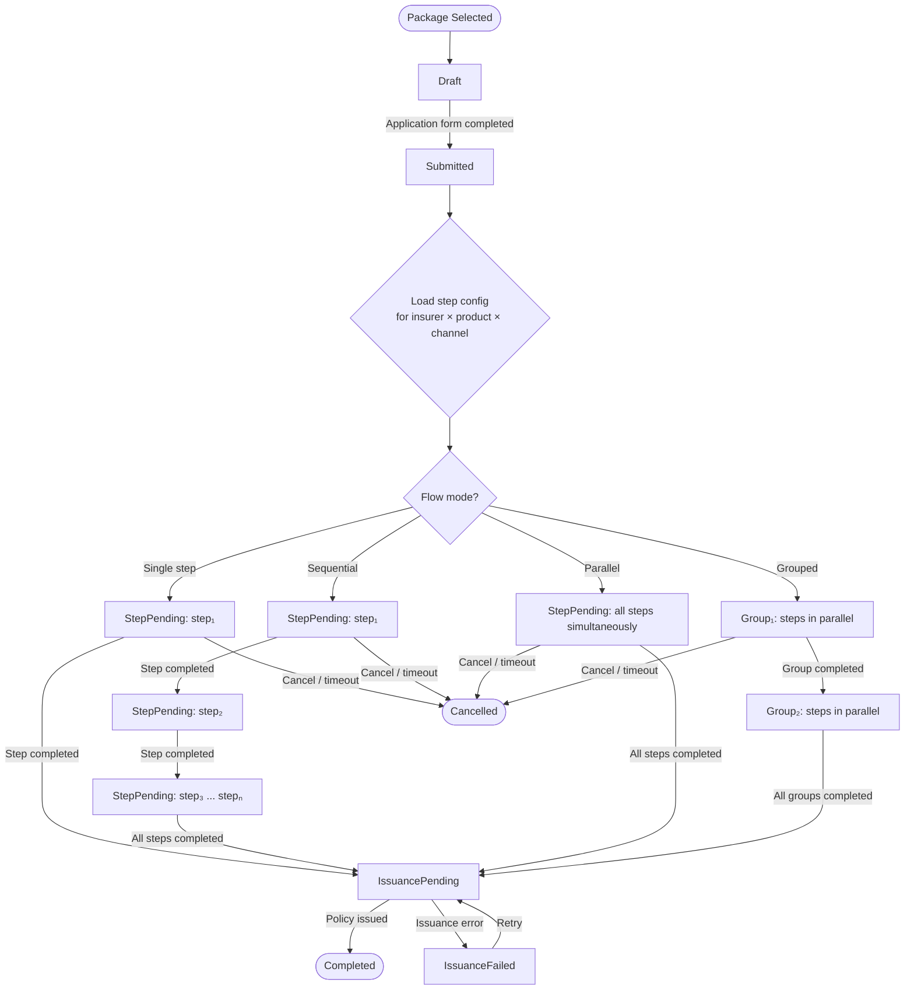
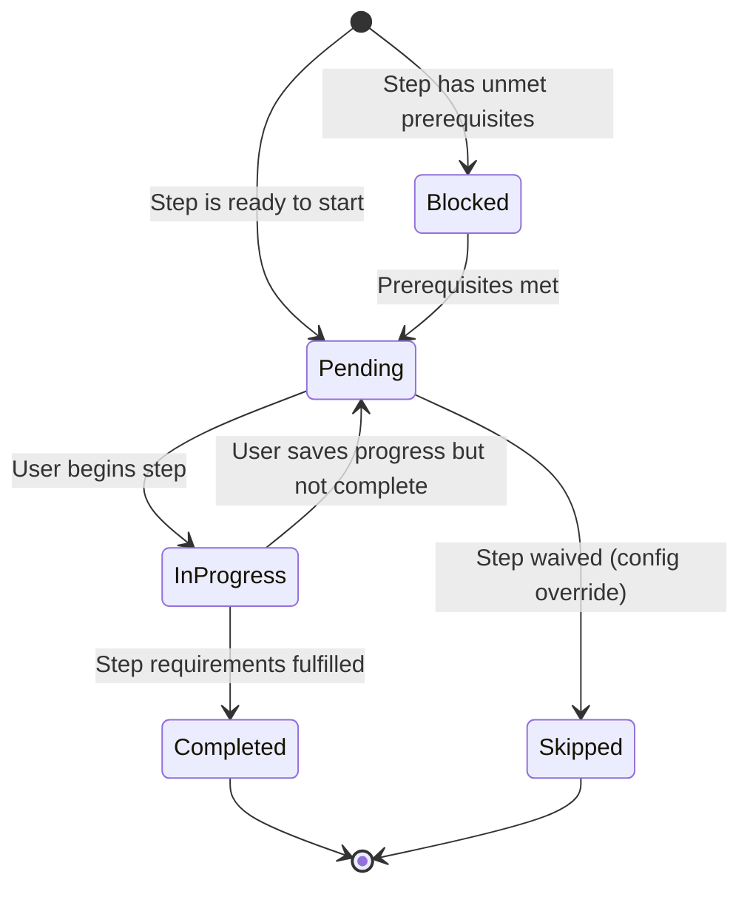

# Capability: Application Management

> **Parent Product:** OnePiece (Insurance Distribution Platform)
> **Product Owner:** TBD
> **Status:** Draft
> **Last Updated:** 2026-03-05

---

## Business Function

Manages the insurance sales application lifecycle from creation (after package selection) through to completion (policy issued). Handles channel-specific flows -- branch applications are staff-operated while online applications are customer self-service.

---

## Feature Inventory

| # | Feature | Status | Description |
|---|---------|--------|-------------|
| 1 | Application Creation | Concept | Create a new application from selected quotation package, pre-fill customer data from DaVinci |
| 2 | Application Form | Concept | Collect required information: customer details, vehicle details, coverage preferences |
| 3 | Application State Machine | Concept | Manage application through configurable completion steps (e.g. document upload, payment, health declaration, vehicle inspection) with flow mode (parallel or sequential) defined per insurer × product × channel combination |
| 4 | Branch Application Flow | Concept | Staff-operated flow with all 6 products, cash/QR payment options |
| 5 | Online Application Flow | Concept | Self-service flow with 4 car products only, 2C2P payment |
| 6 | Application History | Concept | View past and in-progress applications for a customer |
| 7 | Document Upload | Concept | Upload required documents and vehicle photos, requirements vary by insurer-product combination |

---

## Application State Machine

After the application form is completed, the application enters a set of **completion steps**. All required steps must be completed before policy issuance can proceed. The steps, their ordering, and their requirements are **fully configurable per insurer × product × channel combination**.

### Completion Step Model

A **completion step** is a named unit of work that must be fulfilled before the application can advance toward issuance. Steps are not hardcoded — each insurer-product-channel configuration declares which steps are required and in what order.

**Example step types** (non-exhaustive):

| Step Type | Description | Example |
|-----------|-------------|---------|
| `document_upload` | Upload required documents and/or photos | ID card, vehicle photos |
| `payment` | Collect payment from customer | Cash, QR, 2C2P |
| `health_declaration` | Customer completes health questionnaire | PA / health insurance products |
| `beneficiary_nomination` | Customer nominates beneficiaries | Life / PA products |
| `vehicle_inspection` | Physical or photo-based vehicle inspection | Type 1 voluntary motor |
| `consent_signature` | Customer signs consent / disclosure forms | Insurer-specific regulatory requirement |
| `additional_info` | Collect supplementary information | Occupation, income, driving history |

Each insurer-product-channel combination defines:
1. **Which steps** are required (subset of available step types)
2. **Step ordering** via a flow mode

### Flow Modes

The **flow mode** determines how the required steps are orchestrated:

| Flow Mode | Behavior |
|-----------|----------|
| Single step | Only one step required (e.g. payment only) |
| Parallel | All required steps start simultaneously; each completes independently |
| Sequential | Steps must complete in a defined order (step 1 → step 2 → ... → step N) |
| Grouped | Steps are organized into ordered groups; steps within a group run in parallel, groups run sequentially |

### Step Configuration Example

| Insurer | Product | Channel | Required Steps (in order) | Flow Mode |
|---------|---------|---------|---------------------------|-----------|
| VIR | VMI-CAR-1 | Branch | `document_upload` → `vehicle_inspection` → `payment` | Sequential |
| VIR | VMI-CAR-1 | Online | `document_upload`, `payment` (parallel) | Parallel |
| CHUBB | VMI-CAR-1 | Branch | `payment` only | Single step |
| Insurer X | PA-GOLD | Online | Group 1: [`health_declaration`, `beneficiary_nomination`] → Group 2: [`payment`] | Grouped |

> **Note:** The examples above are illustrative. Actual step configurations per insurer-product-channel are defined in the product configuration and may change over time.

### State Machine

The state machine is generic — it does not encode specific step types. Instead, it processes a **step queue** derived from the configuration.

### Step Lifecycle

Each individual step follows its own lifecycle:

---

## Business Rules

| Rule ID | Rule | Condition | Result |
|---------|------|-----------|--------|
| AM-001 | Pre-fill customer data | Customer exists in DaVinci | Auto-populate known fields |
| AM-002 | Channel determines available products | Channel = Online | Restrict to car products only |
| AM-003 | Channel determines payment options | Channel = Branch | Offer Cash, QR |
| AM-004 | Channel determines payment options | Channel = Online | Offer 2C2P only |
| AM-005 | Application timeout | PaymentPending > X hours | Auto-cancel |
| AM-006 | Step configuration is insurer-driven | Per insurer × product × channel combination | Determine which completion steps are required and their flow mode |
| AM-007 | Issuance gate | All required completion steps must be completed or skipped | Block issuance until every step in the configuration reaches Completed or Skipped |
| AM-008 | Parallel mode | Flow mode = Parallel | All required steps start simultaneously; each completes independently |
| AM-009 | Sequential mode | Flow mode = Sequential | Steps must complete in the configured order; next step unlocks only after current completes |
| AM-010 | Grouped mode | Flow mode = Grouped | Steps within a group run in parallel; groups run sequentially in configured order |
| AM-011 | Step type extensibility | New step type needed | New step types can be added without changing the state machine; only configuration and step handler required |
| AM-012 | Step skip/waiver | Insurer config allows waiver for a step | Step moves directly to Skipped; does not block issuance gate |

---

## Document Upload Requirements

Some insurer-product combinations require additional documents and/or vehicle photos after the application form is completed. Requirements are configured per insurer-product combination.

### VIR - VMI-CAR-1 (Voluntary Car Insurance Type 1)

**เอกสารสมัครประกัน (Insurance Application Documents):**

| # | Document | Description |
|---|----------|-------------|
| 1 | บัตรประชาชน | ID Card |
| 2 | หน้ากรรมสิทธิ์ล่าสุด | Latest vehicle ownership/registration page |
| 3 | ใบตรวจสภาพรถยนต์ | Vehicle inspection certificate |

**รูปรถยนต์และอุปกรณ์เสริม (Vehicle Photos & Accessories):**

| # | Photo | Description |
|---|-------|-------------|
| 1 | หน้าซ้าย | Front-left |
| 2 | หน้าขวา | Front-right |
| 3 | หลังซ้าย | Rear-left |
| 4 | หลังขวา | Rear-right |
| 5 | คอนโซล | Console |
| 6 | ห้องโดยสารด้านหน้า | Front passenger compartment |
| 7 | ห้องโดยสารด้านหลัง | Rear passenger compartment |
| 8 | เสริมแนบ/เปลี่ยนเพลา | Accessories / axle modifications |

### CHUBB - VMI-CAR-1 (Voluntary Car Insurance Type 1)

**รูปรถยนต์ (Vehicle Photos):**

| # | Photo | Description |
|---|-------|-------------|
| 1 | หน้าซ้าย | Front-left |
| 2 | หน้าขวา | Front-right |
| 3 | หลังซ้าย | Rear-left |
| 4 | หลังขวา | Rear-right |

---

## Open Questions

- What is the application timeout duration for PaymentPending?
- Can a customer have multiple in-progress applications simultaneously?
- What customer/vehicle data fields are required vs. optional?
- Does the branch flow allow staff to create applications on behalf of walk-in customers without prior DaVinci records?
- Do other insurer-product combinations besides VIR VMI-CAR-1 and CHUBB VMI-CAR-1 require document uploads?
- Are vehicle photo requirements the same across all voluntary type 1 products (regardless of insurer)?
- What is the full step configuration (required steps + flow mode) for each insurer × product × channel combination?
- What additional step types beyond document upload and payment are needed for non-motor products (e.g. PA, health)?
- Can insurers change their step configuration over time (versioning)? How should in-flight applications handle config changes?
- Are there step-level timeout rules (e.g. health declaration expires after 30 days)?
