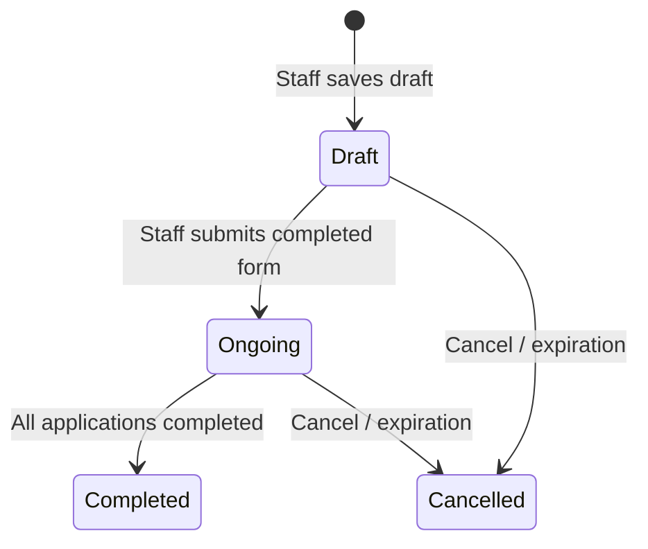
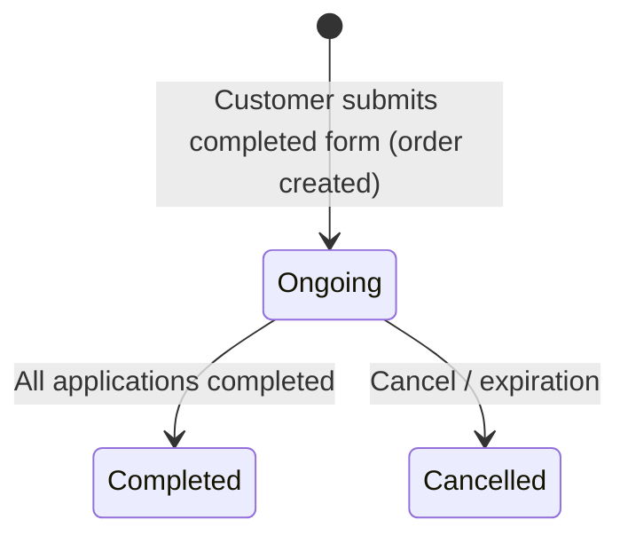
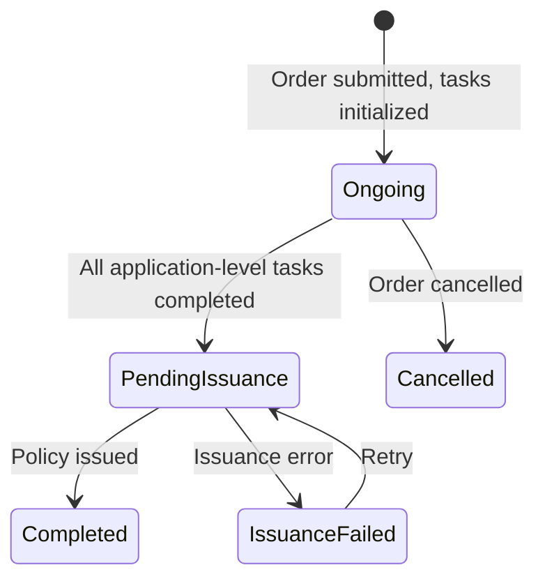
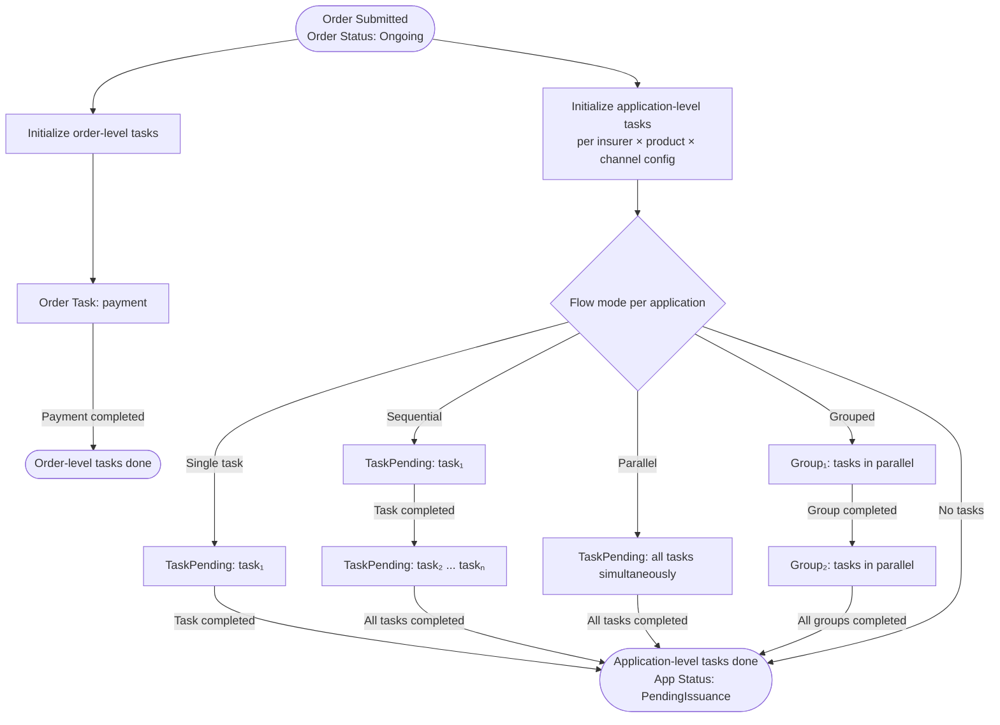
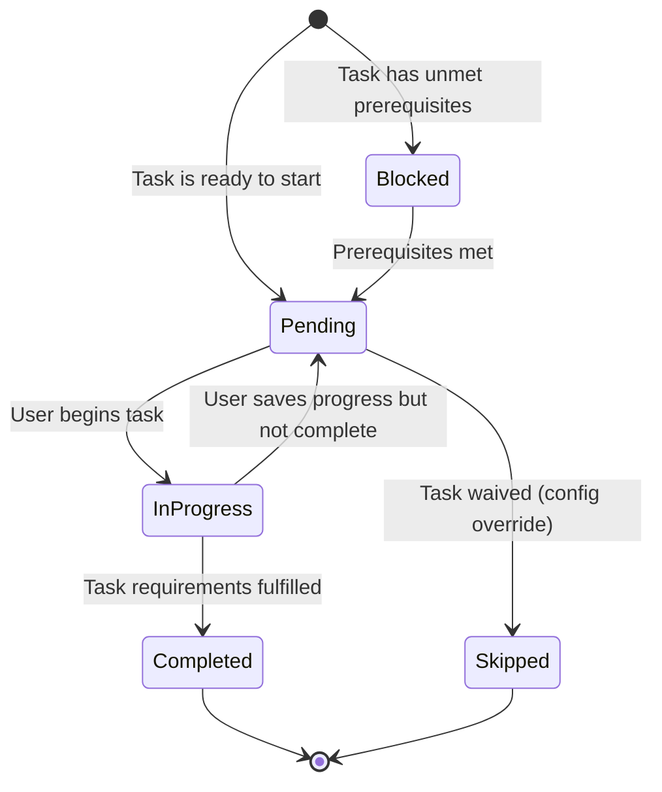

# Capability: Application Management

> **Parent Product:** OnePiece (Insurance Distribution Platform)
> **Product Owner:** TBD
> **Status:** Draft
> **Last Updated:** 2026-03-06

---

## Business Function

Manages the insurance sales lifecycle from application form submission through to policy issuance. The lifecycle is structured as a two-level model: an **Order** (the checkout, containing 1 or 2 packages) and one or more **Applications** (each representing a single insurer × product to be issued as a separate policy). An order is created only when the application form is fully completed and submitted — branch staff may optionally save a draft before submission, while online orders have no server-side state until submission. Handles channel-specific flows — branch is staff-operated, online is customer self-service.

---

## Feature Inventory

| # | Feature | Status | Description |
|---|---------|--------|-------------|
| 1 | Order Creation | Concept | Create an order from selected package(s) upon form submission. **Branch:** order may be saved as `Draft` at staff's discretion before submission; order is created server-side in `Draft` status. **Online:** order is only created upon successful form submission (no server-side Draft); partially filled data is preserved via website cookies for UX. Single package = 1 application. Bundle = 2 applications (1 compulsory + 1 voluntary). |
| 2 | Application Form | Concept | A single unified form for the user (staff or customer) to fill — regardless of single or bundle checkout. Collects customer details, vehicle details, and coverage preferences. Shared across all applications within the same order. **Branch:** includes an optional DaVinci pre-fill section where staff can selectively auto-fill fields from existing customer data. **Online:** no DaVinci pre-fill; cookie-based restoration of previously entered data. Order is created only when the form passes all validations AND the user explicitly submits. |
| 3 | Order & Application State Machine | Concept | Manage order status and per-application status with configurable application-level tasks (e.g. document upload, vehicle inspection) and order-level tasks (e.g. payment). Flow mode (parallel or sequential) defined per insurer × product × channel combination. Channel-specific state machines: branch orders start in `Draft`, online orders start in `Ongoing`. |
| 4 | Branch Flow | Concept | Staff-operated flow with all 6 products, cash/QR payment options. Staff can save draft orders during form-filling. DaVinci pre-fill available as optional section in the application form. |
| 5 | Online Flow | Concept | Self-service flow with 4 car products only, 2C2P payment. No draft orders — form data preserved via cookies until submission. |
| 6 | Order & Application History | Concept | Branch: staff views order list with pending tasks and summarized info. Online: customer views all orders with application statuses and can download/print issued policy documents. |
| 7 | Document Upload | Concept | Upload required documents and vehicle photos as an application-level task; requirements vary by insurer-product combination |

---

## Order → Application Model

The lifecycle is structured as a two-level model:

| Concept | Scope | Contains |
|---------|-------|----------|
| **Order** | The checkout — 1 or 2 packages from the quotation stage | Customer info, sale channel, order-level tasks (e.g. payment), 1–2 applications |
| **Application** | A single insurer × product to be issued as a separate policy | Application-level tasks (e.g. document upload, vehicle inspection), issuance tracking, policy document |

A single-package checkout is an order with 1 application. A bundle checkout is an order with 2 applications (1 compulsory + 1 voluntary, potentially from different insurers).

### Example: Bundle Checkout

```
Order #12345 (bundle checkout, online)
├── Order-level tasks:
│   └── payment (collected once for all applications)
│
├── Application A: VIR × CMI-CAR × Online
│   ├── Application-level tasks: (none per config)
│   ├── Status: PendingIssuance
│   └── Policy: (pending)
│
└── Application B: CHUBB × VMI-CAR-1 × Online
    ├── Application-level tasks: [document_upload]
    ├── Status: Ongoing (waiting for vehicle photos)
    └── Policy: (pending)
```

---

## Order Status

The order has its own user-facing status, independent of (but driven by) its applications. The available statuses differ by channel.

| Status | Description | Branch | Online |
|--------|-------------|--------|--------|
| `Draft` | Order saved by staff but form not yet submitted | Yes | No |
| `Ongoing` | Order submitted; order-level tasks or applications still incomplete | Yes | Yes |
| `Completed` | All applications have reached `Completed` | Yes | Yes |
| `Cancelled` | Order cancelled or expired | Yes | Yes |

### Order Status Diagram — Branch



### Order Status Diagram — Online



> **Order status derivation:** An order is `Ongoing` as long as any order-level task is incomplete OR any application has not reached `Completed`. The order becomes `Completed` only when all order-level tasks are done AND every application is `Completed`.
>
> **Channel difference:** In the branch channel, staff can save a draft order server-side before the form is fully completed. In the online channel, no server-side order exists until the customer submits the completed form — partially filled data is preserved client-side via website cookies.

---

## Application Status

Each application within an order tracks its own status independently.

| Status | Description | Visible To |
|--------|-------------|------------|
| `Ongoing` | Application-level tasks remain incomplete | Staff / Customer |
| `PendingIssuance` | All application-level tasks completed; awaiting policy issuance from insurer | Staff / Customer |
| `IssuanceFailed` | Policy issuance attempted but failed; pending retry | Staff |
| `Completed` | Policy issued successfully | Staff / Customer |
| `Cancelled` | Application cancelled (follows order cancellation) | Staff / Customer |

### Application Status Diagram



> **Note:** Applications do not have a `Draft` status — they are created when the order is submitted and begin in `Ongoing`. If an application has no application-level tasks, it starts directly in `PendingIssuance`.

---

## Task Model

Tasks exist at two levels:

### Task Levels

| Level | Scope | Examples | When Executed |
|-------|-------|---------|---------------|
| **Order-level** | Shared across all applications in the order | `payment` | Once per order, regardless of number of applications |
| **Application-level** | Specific to one insurer × product combination | `document_upload`, `vehicle_inspection`, `health_declaration`, `consent_signature` | Per application, configured by insurer × product × channel |

### What is a Task?

A **task** is a named unit of work that must be fulfilled before the order or application can advance. Tasks are not hardcoded — configuration declares which tasks are required.

**Order-level task types:**

| Task Type | Description | Example |
|-----------|-------------|---------|
| `payment` | Collect payment for the entire order | Cash, QR, 2C2P |

**Application-level task types** (non-exhaustive):

| Task Type | Description | Example |
|-----------|-------------|---------|
| `document_upload` | Upload required documents and/or photos | ID card, vehicle photos |
| `health_declaration` | Customer completes health questionnaire | PA / health insurance products |
| `beneficiary_nomination` | Customer nominates beneficiaries | Life / PA products |
| `vehicle_inspection` | Physical or photo-based vehicle inspection | Type 1 voluntary motor |
| `consent_signature` | Customer signs consent / disclosure forms | Insurer-specific regulatory requirement |
| `additional_info` | Collect supplementary information | Occupation, income, driving history |

Each insurer-product-channel combination defines:
1. **Which application-level tasks** are required (subset of available task types)
2. **Task ordering** via a flow mode

### Flow Modes

The **flow mode** determines how the required application-level tasks are orchestrated:

| Flow Mode | Behavior |
|-----------|----------|
| Single task | Only one task required |
| Parallel | All required tasks start simultaneously; each completes independently |
| Sequential | Tasks must complete in a defined order (task 1 → task 2 → ... → task N) |
| Grouped | Tasks are organized into ordered groups; tasks within a group run in parallel, groups run sequentially |

### Task Configuration Example

| Insurer | Product | Channel | Required Application-Level Tasks (in order) | Flow Mode |
|---------|---------|---------|----------------------------------------------|-----------|
| VIR | VMI-CAR-1 | Branch | `document_upload` → `vehicle_inspection` | Sequential |
| VIR | CMI-CAR | Branch | (none) | — |
| CHUBB | VMI-CAR-1 | Branch | `document_upload` | Single task |
| CHUBB | VMI-CAR-1 | Online | `document_upload` | Single task |
| Insurer X | PA-GOLD | Online | Group 1: [`health_declaration`, `beneficiary_nomination`] → Group 2: [`consent_signature`] | Grouped |

> **Note:** Payment is no longer in this table — it is always an order-level task. The examples above are illustrative; actual configurations may change over time.

### Task Orchestration

After the order is submitted, order-level and application-level tasks are initialized. The orchestration engine processes tasks at both levels.



### Task Lifecycle

Each individual task (order-level or application-level) follows its own lifecycle:



---

## Business Rules

### Order-Level Rules

| Rule ID | Rule | Condition | Result |
|---------|------|-----------|--------|
| AM-001 | Pre-fill customer data (branch only) | Channel = Branch AND customer exists in DaVinci | Staff can use the optional DaVinci pre-fill section within the application form; not available in online channel |
| AM-013 | Selective pre-fill | Channel = Branch AND pre-fill used | Staff selects which sections/fields to pre-fill from DaVinci data within the application form; unselected sections remain empty for manual entry |
| AM-002 | Channel determines available products | Channel = Online | Restrict to car products only |
| AM-003 | Channel determines payment options | Channel = Branch | Offer Cash, QR |
| AM-004 | Channel determines payment options | Channel = Online | Offer 2C2P only |
| AM-017 | Order composition | Single package selected | Order contains 1 application |
| AM-018 | Order composition (bundle) | Bundle selected (1 compulsory + 1 voluntary) | Order contains 2 applications; payment is collected once at order level |
| AM-019 | Payment is order-level | Always | Payment task belongs to the order, not individual applications; collected once regardless of number of applications |
| AM-005 | Order timeout | Order Ongoing > X hours with no progress | Auto-cancel order (order status → Cancelled; all application statuses → Cancelled) |
| AM-024 | Order creation trigger | Channel = Branch AND staff saves draft | Order is created server-side in `Draft` status; form data is persisted but not yet submitted |
| AM-025 | Order creation trigger (online) | Channel = Online AND customer submits form (all validations pass) | Order is created directly in `Ongoing` status; no Draft state exists for online |
| AM-026 | Online form persistence | Channel = Online AND form partially filled | No server-side order is created; partially filled data is preserved via website cookies for UX continuity |
| AM-020 | Order status: Ongoing (branch) | Channel = Branch AND staff submits completed form (all validations pass) | Order status changes from Draft to Ongoing; order-level tasks and applications are initialized |
| AM-027 | Order status: Ongoing (online) | Channel = Online AND customer submits completed form (all validations pass) | Order is created in Ongoing; order-level tasks and applications are initialized |
| AM-021 | Order status: Completed | All applications reach Completed | Order status changes from Ongoing to Completed |
| AM-022 | Order cancellation cascades | Order cancelled | All applications within the order are also cancelled |

### Application-Level Rules

| Rule ID | Rule | Condition | Result |
|---------|------|-----------|--------|
| AM-006 | Task configuration is insurer-driven | Per insurer × product × channel combination | Determine which application-level tasks are required and their flow mode |
| AM-007 | Issuance gate | All required application-level tasks completed or skipped AND order-level payment completed | Application can transition to PendingIssuance |
| AM-008 | Parallel mode | Flow mode = Parallel | All required tasks start simultaneously; each completes independently |
| AM-009 | Sequential mode | Flow mode = Sequential | Tasks must complete in the configured order; next task unlocks only after current completes |
| AM-010 | Grouped mode | Flow mode = Grouped | Tasks within a group run in parallel; groups run sequentially in configured order |
| AM-011 | Task type extensibility | New task type needed | New task types can be added without changing the orchestration engine; only configuration and task handler required |
| AM-012 | Task skip/waiver | Insurer config allows waiver for a task | Task moves directly to Skipped; does not block issuance gate |
| AM-014 | Application status: Ongoing | Order submitted | Application starts in Ongoing; application-level tasks initialized per config |
| AM-023 | Application status: no tasks | Application has no configured application-level tasks AND order-level payment completed | Application starts directly in PendingIssuance |
| AM-015 | Application status: PendingIssuance | All application-level tasks completed or skipped AND order-level payment completed | Application status changes to PendingIssuance; policy issuance is triggered |
| AM-016 | Application status: IssuanceFailed | Issuance error from insurer | Application status changes to IssuanceFailed; retry is available |

---

## Document Upload Requirements

Some insurer-product combinations require additional documents and/or vehicle photos after the application form is completed. Requirements are configured per insurer-product combination.

### VIR - VMI-CAR-1 (Voluntary Car Insurance Type 1)

**เอกสารสมัครประกัน (Insurance Application Documents):**

| # | Document | Description |
|---|----------|-------------|
| 1 | บัตรประชาชน | ID Card |
| 2 | หน้ากรรมสิทธิ์ล่าสุด | Latest vehicle ownership/registration page |
| 3 | ใบตรวจสภาพรถยนต์ | Vehicle inspection certificate |

**รูปรถยนต์และอุปกรณ์เสริม (Vehicle Photos & Accessories):**

| # | Photo | Description |
|---|-------|-------------|
| 1 | หน้าซ้าย | Front-left |
| 2 | หน้าขวา | Front-right |
| 3 | หลังซ้าย | Rear-left |
| 4 | หลังขวา | Rear-right |
| 5 | คอนโซล | Console |
| 6 | ห้องโดยสารด้านหน้า | Front passenger compartment |
| 7 | ห้องโดยสารด้านหลัง | Rear passenger compartment |
| 8 | เสริมแนบ/เปลี่ยนเพลา | Accessories / axle modifications |

### CHUBB - VMI-CAR-1 (Voluntary Car Insurance Type 1)

**รูปรถยนต์ (Vehicle Photos):**

| # | Photo | Description |
|---|-------|-------------|
| 1 | หน้าซ้าย | Front-left |
| 2 | หน้าขวา | Front-right |
| 3 | หลังซ้าย | Rear-left |
| 4 | หลังขวา | Rear-right |

---

## Open Questions

- What is the order timeout/expiration duration?
- Can a customer have multiple in-progress orders simultaneously?
- What customer/vehicle data fields are required vs. optional?
- Does the branch flow allow staff to create applications on behalf of walk-in customers without prior DaVinci records?
- Do other insurer-product combinations besides VIR VMI-CAR-1 and CHUBB VMI-CAR-1 require document uploads?
- Are vehicle photo requirements the same across all voluntary type 1 products (regardless of insurer)?
- What is the full task configuration (required tasks + flow mode) for each insurer × product × channel combination?
- What additional task types beyond document upload and payment are needed for non-motor products (e.g. PA, health)?
- Can insurers change their task configuration over time (versioning)? How should in-flight applications handle config changes?
- Are there task-level timeout rules (e.g. health declaration expires after 30 days)?
