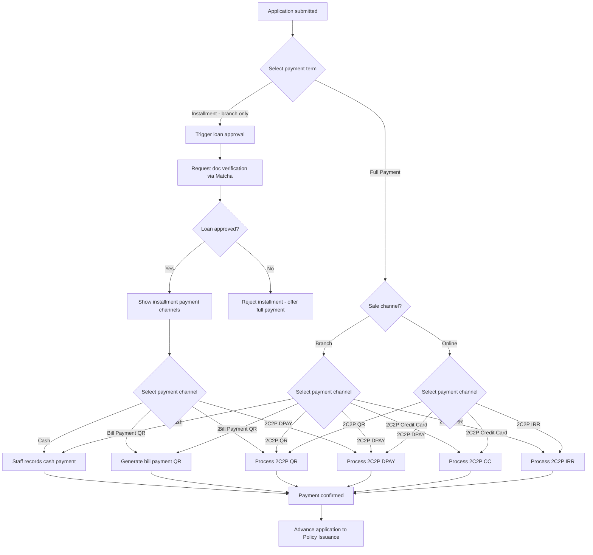

# Capability: Payment Processing

> **Parent Product:** OnePiece (Insurance Distribution Platform)
> **Product Owner:** TBD
> **Status:** Draft
> **Last Updated:** 2026-03-05

---

## Business Function

Handles payment for insurance applications. Routes to the correct payment channel based on sale channel, manages payment term selection (full vs. installment), triggers loan approval for installment payments, and confirms payment to advance the application.

---

## Feature Inventory

| # | Feature | Status | Description |
|---|---------|--------|-------------|
| 1 | Payment Term Selection | Concept | Customer/staff selects full payment or installment (branch only for installment) |
| 2 | Payment Channel Routing | Concept | Determine available payment channels based on sale channel and payment term |
| 3 | Cash Payment Processing | Concept | Branch staff records cash payment received |
| 4 | Bill Payment QR Processing | Concept | Generate bill payment QR code at branch, confirm upon payment |
| 5 | 2C2P QR Payment | Concept | 2C2P QR payment processing (branch planned, online current) |
| 6 | 2C2P DPAY Payment | Concept | 2C2P direct payment processing (branch planned, online current) |
| 7 | 2C2P Credit Card Payment | Concept | 2C2P credit card payment -- full payment term only |
| 8 | 2C2P IRR Payment | Concept | 2C2P installment via credit card issuer -- full payment term only |
| 9 | Installment Loan Approval | Concept | Trigger document verification (Matcha) and loan approval for installment term |
| 10 | Payment Confirmation | Concept | Confirm payment received and advance application to issuance |

---

## Payment Flow

---

## Business Rules

### Current State

| Rule ID | Rule | Condition | Result |
|---------|------|-----------|--------|
| PM-001 | Branch payment channels | Channel = Branch | Available: Cash, Bill Payment QR |
| PM-002 | Online payment channel | Channel = Online | Available: 2C2P |
| PM-003 | Online is full payment only | Channel = Online | Payment Term = Full Payment (no installment) |
| PM-004 | Installment requires approval | Payment Term = Installment | Must pass loan approval + Matcha doc verification |
| PM-005 | Installment rejection fallback | Loan approval = Rejected | Offer full payment as alternative |
| PM-006 | Payment timeout | Payment not received within X hours | Cancel application |

### Planned State

| Rule ID | Rule | Condition | Result |
|---------|------|-----------|--------|
| PM-P001 | Branch full payment channels | Channel = Branch AND Term = Full Payment | Available: Cash, Bill Payment QR, 2C2P QR, 2C2P DPAY, 2C2P Credit Card, 2C2P IRR |
| PM-P002 | Branch installment channels | Channel = Branch AND Term = Installment | Available: Cash, Bill Payment QR, 2C2P QR, 2C2P DPAY |
| PM-P003 | Online full payment channels | Channel = Online AND Term = Full Payment | Available: 2C2P QR, 2C2P DPAY, 2C2P Credit Card, 2C2P IRR |
| PM-P004 | Online is full payment only | Channel = Online | Payment Term = Full Payment (no installment) |
| PM-P005 | Cash and Bill Payment QR are branch-only | Channel = Online | Block: Cash, Bill Payment QR not available |
| PM-P006 | 2C2P CC and IRR are full-payment only | Payment Term = Installment | Block: 2C2P Credit Card, 2C2P IRR not available |
| PM-P007 | Installment requires approval | Payment Term = Installment | Must pass loan approval + Matcha doc verification |
| PM-P008 | Installment rejection fallback | Loan approval = Rejected | Offer full payment as alternative |
| PM-P009 | Payment timeout | Payment not received within X hours | Cancel application |

---

## NFRs

| Requirement | Target |
|-------------|--------|
| 2C2P payment confirmation latency | < 30 seconds |
| Payment data encryption | PCI-DSS compliant |
| Reconciliation | Daily reconciliation of all payment channels |

---

## Open Questions

- What are the installment terms (number of months, interest rate, down payment)?
- What documents does Matcha need to verify for installment approval?
- Is partial payment supported (e.g., down payment for installment)?
- QR payment: which QR standard (PromptPay, insurer-specific)?
- Cash payment: is receipt generation required?
