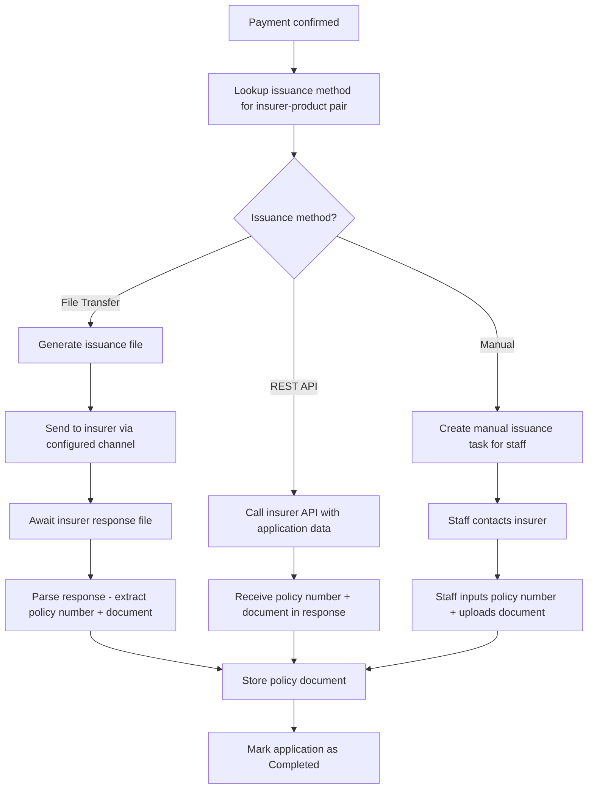

# Capability: Policy Issuance

> **Parent Product:** OnePiece (Insurance Distribution Platform)
> **Product Owner:** TBD
> **Status:** Draft
> **Last Updated:** 2026-03-05

---

## Business Function

Executes policy issuance after payment confirmation by dispatching to the correct insurer integration method. The issuance method (file transfer, REST API, or manual input) is determined by the insurer-product combination configured in the Product Catalog.

---

## Feature Inventory

| # | Feature | Status | Description |
|---|---------|--------|-------------|
| 1 | Issuance Method Dispatcher | Concept | Route issuance request to correct method based on insurer-product configuration |
| 2 | File Transfer Issuance | Concept | Generate and send batch files to insurer; receive policy files back |
| 3 | REST API Issuance | Concept | Real-time API call to insurer system to issue policy and receive policy document |
| 4 | Manual Issuance | Concept | Staff manually inputs policy number and uploads policy document received from insurer |
| 5 | Policy Document Storage | Concept | Store issued policy documents and associate with application |
| 6 | Issuance Status Tracking | Concept | Track issuance state: Pending -> In Progress -> Issued / Failed |

---

## Issuance Flow

---

## Business Rules

| Rule ID | Rule | Condition | Result |
|---------|------|-----------|--------|
| PI-001 | Issuance method lookup | Insurer = X, Product = Y | Use configured method (file transfer / API / manual) |
| PI-002 | File transfer schedule | Method = File Transfer | Process per batch schedule (configurable) |
| PI-003 | API timeout | Method = REST API, Response > X seconds | Mark as failed, allow retry |
| PI-004 | Manual task assignment | Method = Manual | Assign to branch staff / back-office team |
| PI-005 | Issuance failure | Any method fails | Keep application in IssuancePending, allow retry |

---

## Open Questions

- What file formats are used for file transfer (CSV, XML, proprietary)?
- What is the SLA for file transfer turnaround (send file -> receive policy)?
- For manual issuance, who is responsible -- branch staff or a central back-office team?
- Should the system support mixed methods (e.g., API for quotation but file transfer for issuance) per insurer?
- How are insurer API credentials and endpoints managed?
