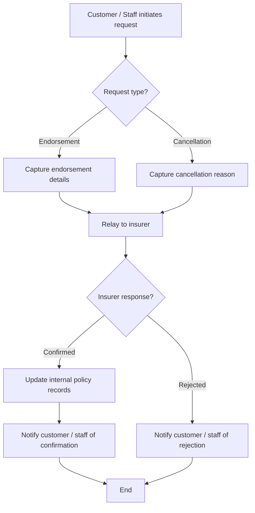

# Capability: Post-Sale Management

> **Parent Product:** OnePiece (Insurance Distribution Platform)
> **Product Owner:** TBD
> **Status:** Draft
> **Last Updated:** 2026-03-05

---

## Business Function

Manages endorsement and cancellation requests after a policy has been issued. OnePiece acts as a broker/intermediary -- it receives the request from the customer (via branch or online), relays it to the insurer, and updates internal records upon insurer confirmation. OnePiece does not make endorsement/cancellation decisions; the insurer does.

---

## Feature Inventory

| # | Feature | Status | Description |
|---|---------|--------|-------------|
| 1 | Endorsement Request | Concept | Customer/staff submits a request to modify an existing policy (e.g., change vehicle, add coverage) |
| 2 | Cancellation Request | Concept | Customer/staff submits a request to cancel an existing policy |
| 3 | Insurer Relay | Concept | System relays endorsement/cancellation request to the insurer via configured channel |
| 4 | Insurer Confirmation Handling | Concept | Receive and process insurer's confirmation or rejection of the request |
| 5 | Internal Record Update | Concept | Update policy records in OnePiece upon insurer confirmation |

---

## Post-Sale Flow

---

## Business Rules

| Rule ID | Rule | Condition | Result |
|---------|------|-----------|--------|
| PS-001 | Broker role only | Any endorsement/cancellation request | OnePiece relays, does not decide |
| PS-002 | Record update on confirmation only | Insurer confirms endorsement/cancellation | Update internal records |
| PS-003 | No unilateral changes | Insurer has not confirmed | Internal records remain unchanged |

---

## Open Questions

- What endorsement types are supported (vehicle change, coverage change, beneficiary change, etc.)?
- What is the communication channel with insurers for post-sale requests (same as issuance method, or separate)?
- Is there a refund flow for cancellations?
- What is the expected SLA for insurer response on endorsements/cancellations?
- Can customers initiate post-sale requests via the online channel, or branch only?
