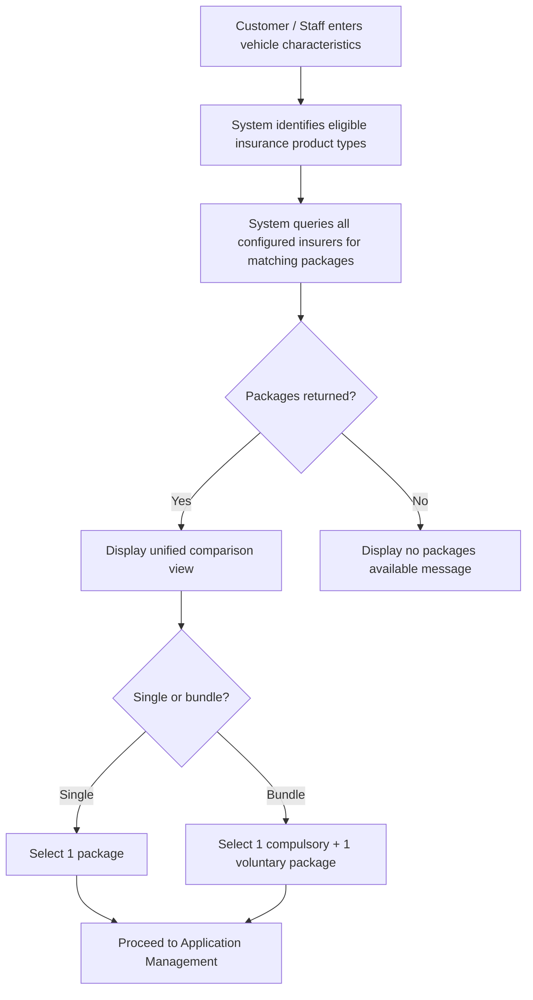

# Capability: Quotation & Comparison

> **Parent Product:** OnePiece (Insurance Distribution Platform)
> **Product Owner:** TBD
> **Status:** Draft
> **Last Updated:** 2026-03-06

---

## Business Function

The user-facing product catalog and quotation experience. Retrieves insurance packages from the package master based on vehicle characteristics input by the customer or branch staff, presents the catalog with filtering and sorting, displays a comparison view, and enables package selection. This capability owns what the user sees — the catalog presentation, search experience, and package comparison — while the underlying master data and configuration are owned by [Package Master & Channel Configuration](../product-catalog/CAPABILITY.md).

---

## Feature Inventory

| # | Feature | Status | Description |
|---|---------|--------|-------------|
| 1 | Vehicle Characteristic Input | Concept | Channel-specific search form for entering vehicle details to find eligible packages. Required input fields differ by sale channel and product type — see Search Input Fields section below. |
| 2 | Package Catalog Display | Concept | Presents available packages to users with filtering and sorting capabilities. Packages are sourced from the package master and filtered by channel availability, release dates, and vehicle eligibility. |
| 3 | Package Comparison Display | Concept | Unified view showing all available packages across insurers with price, coverage, and terms |
| 4 | Package Selection | Concept | Customer/staff selects a specific package to proceed to application |
| 5 | Bundle Checkout | Concept | Customer/staff can select 1 compulsory + 1 voluntary insurance as a bundle in a single checkout |

---

## User Flow

---

## Search Input Fields by Channel & Product

The required vehicle search input fields differ by **sale channel** and **product type**. Vehicle master data attributes are defined in [Package Master & Channel Configuration](../product-catalog/CAPABILITY.md).

**Branch — Voluntary Car Insurance & Compulsory Car Insurance (same inputs):**

| # | Search Input Field |
|---|-------------------|
| 1 | Brand |
| 2 | Model |
| 3 | Year Group |
| 4 | Body Type |
| 5 | Description |
| 6 | Plate Province |
| 7 | Accessory (list) |

**Online — Voluntary Car Insurance:**

| # | Search Input Field |
|---|-------------------|
| 1 | Brand |
| 2 | Model |
| 3 | Year Group |
| 4 | Sub Model |
| 5 | Plate Province |

**Online — Compulsory Car Insurance:**

| # | Search Input Field |
|---|-------------------|
| 1 | Body Type |
| 2 | Brand |
| 3 | Model |
| 4 | Year Group |
| 5 | Sub Model |
| 6 | Plate Province |

> **Key differences:** Branch uses the same input fields for both voluntary and compulsory, and includes Description and Accessory. Online separates voluntary and compulsory inputs — compulsory adds Body Type. Online uses Sub Model instead of Description/Accessory.

---

## Business Rules

| Rule ID | Rule | Condition | Result |
|---------|------|-----------|--------|
| QT-001 | Only display packages matching vehicle type | Vehicle = Car | Show car insurance products only |
| QT-002 | Only display packages matching vehicle type | Vehicle = Motorcycle | Show motorcycle insurance products only |
| QT-003 | Filter by channel availability | Package not active on requested channel (per release date / end date) | Exclude from results |
| QT-009 | Package comparison availability (current) | Channel = Branch | Package comparison view is not available; staff selects package without comparison |
| QT-010 | Package comparison availability (planned) | Channel = Branch OR Online | Package comparison view is available in all sale channels |
| QT-004 | Display all insurer packages | Multiple insurers offer same product type | Show all packages from all insurers |
| QT-005 | Bundle checkout eligibility | Customer selects bundle | Must be exactly 1 compulsory + 1 voluntary insurance |
| QT-006 | Bundle available in both channels | Channel = Branch OR Online | Bundle checkout is offered |
| QT-007 | Bundle cross-insurer allowed | Bundle selected | Compulsory and voluntary can be from different insurers |
| QT-008 | No bundle discount | Bundle selected | Total price = sum of individual prices (checkout convenience only) |

---

## Open Questions

- How are insurer packages retrieved? Real-time API call per insurer or cached/pre-loaded catalog?
- ~~What vehicle characteristics are required as input?~~ **Resolved:** Documented per channel × product type in Search Input Fields section above.
- Is there a timeout/fallback if an insurer's system is slow or unavailable during quotation?
- Do we display insurer brand/logo alongside packages?
- ~~Bundle checkout: must the compulsory and voluntary packages be from the same insurer, or can they be mixed?~~ **Resolved: cross-insurer allowed**
- ~~Bundle checkout: is there a price discount for bundles, or is it purely a checkout convenience?~~ **Resolved: no discount, checkout convenience only**
