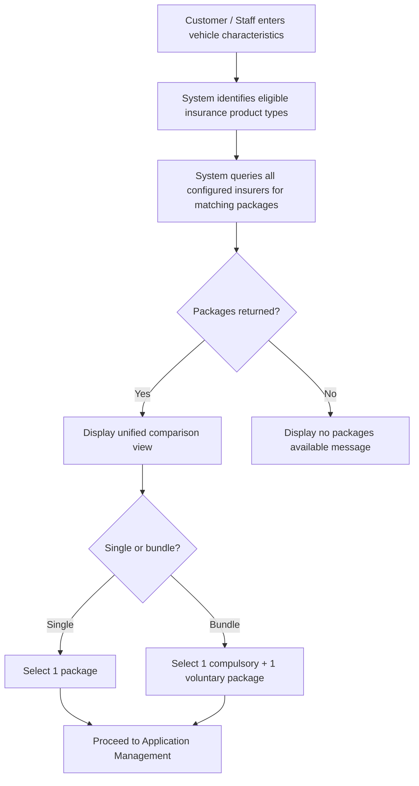

# Capability: Quotation & Comparison

> **Parent Product:** OnePiece (Insurance Distribution Platform)
> **Product Owner:** TBD
> **Status:** Draft
> **Last Updated:** 2026-03-05

---

## Business Function

Retrieves insurance packages from multiple insurers based on vehicle characteristics input by the customer or branch staff, aggregates them, and presents a unified comparison view. The customer/staff then selects a package to proceed with.

---

## Feature Inventory

| # | Feature | Status | Description |
|---|---------|--------|-------------|
| 1 | Vehicle Characteristic Input | Concept | Form for entering vehicle details (make, model, year, registration, etc.) to determine eligible packages |
| 2 | Multi-Insurer Package Retrieval | Concept | Fetch available packages from all configured insurers matching the vehicle characteristics |
| 3 | Package Comparison Display | Concept | Unified view showing all available packages across insurers with price, coverage, and terms |
| 4 | Package Selection | Concept | Customer/staff selects a specific package to proceed to application |
| 5 | Bundle Checkout | Concept | Customer/staff can select 1 compulsory + 1 voluntary insurance as a bundle in a single checkout |

---

## User Flow

---

## Business Rules

| Rule ID | Rule | Condition | Result |
|---------|------|-----------|--------|
| QT-001 | Only display packages matching vehicle type | Vehicle = Car | Show car insurance products only |
| QT-002 | Only display packages matching vehicle type | Vehicle = Motorcycle | Show motorcycle insurance products only |
| QT-003 | Filter by channel availability | Channel = Online AND Product = motorcycle | Exclude from results |
| QT-009 | Package comparison availability (current) | Channel = Branch | Package comparison view is not available; staff selects package without comparison |
| QT-010 | Package comparison availability (planned) | Channel = Branch OR Online | Package comparison view is available in all sale channels |
| QT-004 | Display all insurer packages | Multiple insurers offer same product type | Show all packages from all insurers |
| QT-005 | Bundle checkout eligibility | Customer selects bundle | Must be exactly 1 compulsory + 1 voluntary insurance |
| QT-006 | Bundle available in both channels | Channel = Branch OR Online | Bundle checkout is offered |
| QT-007 | Bundle cross-insurer allowed | Bundle selected | Compulsory and voluntary can be from different insurers |
| QT-008 | No bundle discount | Bundle selected | Total price = sum of individual prices (checkout convenience only) |

---

## Open Questions

- How are insurer packages retrieved? Real-time API call per insurer or cached/pre-loaded catalog?
- What vehicle characteristics are required as input (make, model, year, engine size, registration province, etc.)?
- Is there a timeout/fallback if an insurer's system is slow or unavailable during quotation?
- Do we display insurer brand/logo alongside packages?
- ~~Bundle checkout: must the compulsory and voluntary packages be from the same insurer, or can they be mixed?~~ **Resolved: cross-insurer allowed**
- ~~Bundle checkout: is there a price discount for bundles, or is it purely a checkout convenience?~~ **Resolved: no discount, checkout convenience only**
