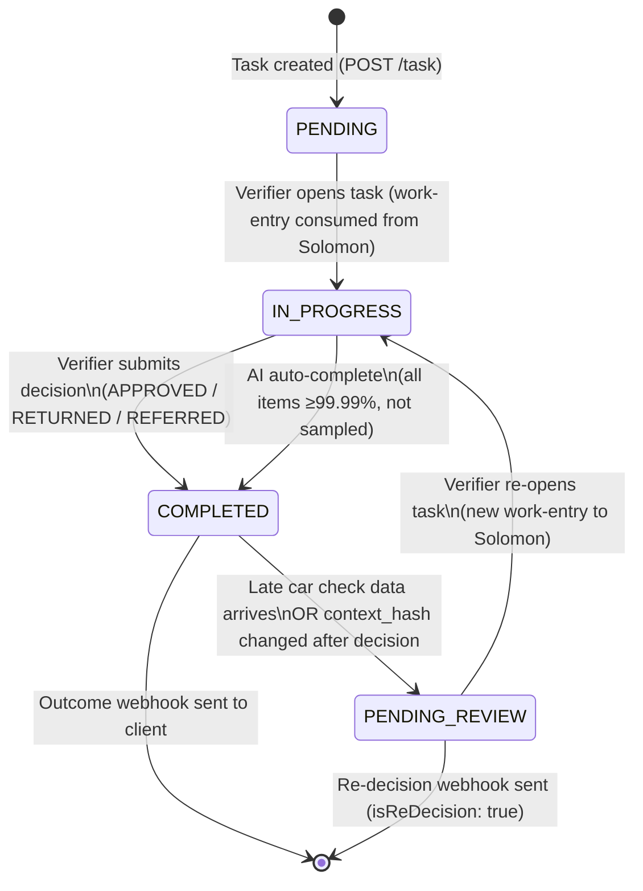
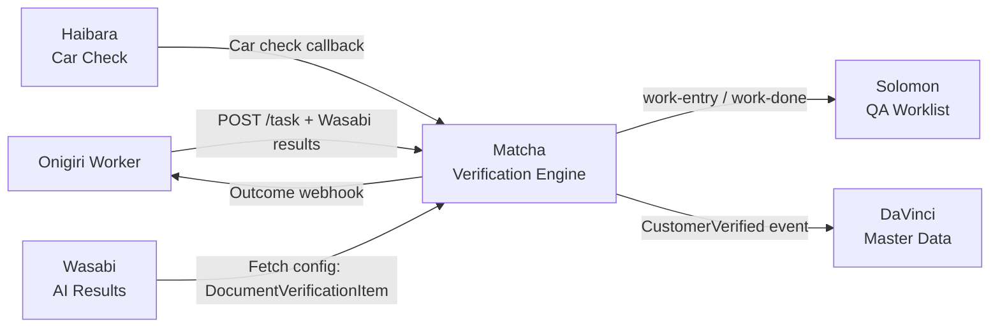

# Product: Document Verification Service

**Codename**: Matcha (抹茶)
**Portfolio**: Operations → [PORTFOLIO](../../PORTFOLIO.md)
**Status**: ✅ Active
**Executive Owner**: COO / Head of Operations
**Last Updated**: 2026-03-17

> *Matcha (抹茶) — The universal solvent of the tea world. Matcha dissolves into any blend and provides consistent quality. Similarly, Matcha dissolves into any business domain's workflow and provides consistent, auditable document verification — regardless of the originating product.*

---

## Problem Statement

Document verification is required across multiple business domains (Loans via Onigiri, Insurance, KYC). Previously, each domain required a separate verification implementation with its own audit trail, rule configuration, and QA distribution logic. This created fragmentation: inconsistent verification quality, duplicated operational overhead, and no unified compliance audit trail.

---

## Value Proposition

A single, domain-agnostic document verification engine that any client system can use by submitting a task. Provides a universal 4-state task lifecycle, database-driven verification rules, SHA-256 change detection, async car check integration, smart re-flow deduplication, and AI-first routing via Wasabi. All verification activity — human and AI — flows through Matcha for a complete, immutable audit trail.

**For whom**: QA verifiers who review documents; Operations engineers who configure verification rules; Client systems (Onigiri, future Insurance/KYC) that need documents verified; AI/ML team whose Wasabi results are routed through Matcha.

---

## Product Boundary

**This product IS responsible for:**
- Document verification task lifecycle (PENDING → IN_PROGRESS → COMPLETED → PENDING_REVIEW)
- Verification rule configuration (data items, policy items, per-document correct/incorrect decisions)
- QA distribution to Solomon worklist (Raijin/Hephaestus work-entry/work-done events)
- Car check integration (sync/async hybrid, bypass with cut-off, PENDING_REVIEW re-entry)
- Dual-hash change detection (context_hash / decision_hash) and decision invalidation
- Re-flow deduplication (same surrogate key versioning, smart result copy for unchanged docs)
- AI-first verification routing: receiving Wasabi results, running Verification Router, auto-completing confident tasks, distributing uncertain tasks to human QA, spot-check sampling
- Immutable audit trail (TaskCompletionEvent per decision — human, AI, or re-decision)
- Configuration API for Wasabi to fetch verification instructions

**This product IS NOT responsible for:**
- LLM processing and AI report assembly (owned by **Wasabi**)
- Loan workflow orchestration or application state management (owned by **Onigiri**)
- Application field extraction or deciding which application fields map to verification data items (owned by **Onigiri** — Data Extraction Templates determine what values populate `documents[].data`)
- Customer master data and Golden Record (owned by **DaVinci**)
- Branch task tracking or field staff worklist (owned by **Sensei**)
- QA worklist UX (owned by **Solomon** / Raijin/Hephaestus ecosystem)

**This product RECEIVES from:**
- Onigiri Worker → task creation payload (documents + `data` key-value pairs where keys match Matcha's `check_name` + Wasabi AI results) → via POST /task REST API
- Haibara → car check results callback → via POST /api/document-verification/car-check-result
- Wasabi → (indirectly, via Onigiri) AI verification results attached to task creation payload

**This product SENDS to:**
- Onigiri → verification outcome webhook (APPROVED / RETURNED / REFERRED + callbackUrl) → via POST webhook
- Raijin / Hephaestus → work-entry (new task) and work-done (completed task) for Solomon QA distribution → via SQS events
- DaVinci → CustomerVerified, CustomerKYCExpired events → via event
- Wasabi → DocumentVerificationItem configuration (fetched by Wasabi per documentTypeKey) → via REST API (Wasabi pulls)

---

## Capability Registry

| Capability | Owner | Status | Description |
|-----------|-------|--------|-------------|
| [Universal Document Verification Engine](capabilities/universal-document-verification-engine/CAPABILITY.md) | Engineering | Active | Domain-agnostic task processing. 4-state lifecycle: PENDING → IN_PROGRESS → COMPLETED → PENDING_REVIEW. Solomon integration via work-entry/work-done events. |
| [Flexible Logic Configuration](capabilities/flexible-logic-configuration/CAPABILITY.md) | Product | Active | DB-driven data items (field matching) and policy items (subjective boolean checks). Per-document correct/incorrect. Save-as-you-go persistence. Task outcomes: APPROVED, RETURNED, REFERRED. |
| [Async Car Check Integration](capabilities/async-car-check-integration/CAPABILITY.md) | Engineering | Active | Hybrid sync/async car check with manual refresh and push callbacks. Bypass with cut-off. Late data handling via PENDING_REVIEW re-entry. Full re-decision authority. |
| [Safety and Integrity Guardrails](capabilities/safety-integrity-guardrails/CAPABILITY.md) | Engineering | Active | Dual-hash change detection (context_hash / decision_hash). Visual "Revised" alert. Pre-filled decision clearing on changed docs. Immutable TaskCompletionEvent audit trail. |
| [Re-flow](capabilities/re-flow/CAPABILITY.md) | Engineering | Active | Same surrogate key versioning. Smart result copy for unchanged documents (matching context_hash). is_changed flag for modified docs. previous_document_id linking. |
| [AI-First Verification](capabilities/ai-first-verification/CAPABILITY.md) | Product | Draft | Verification Router: routes based on Wasabi AI results. Uncertain → Human QA. Confident (≥99.99%) → Auto-Complete. 0.1% spot-check sampling. All tasks through Matcha for full audit trail. |

---

## Task Lifecycle State Machine

---

## Integration Map

---

## Product-Level Metrics and KPIs

| Metric | Description | Target |
|--------|-------------|--------|
| Auto-Verification Rate | % of Matcha tasks auto-completed by AI (no human QA) | > 70% (12-month target) |
| False Positive Rate | % of AI auto-verified items overridden during spot-checks | ≤ 0.01% |
| Task Completion Time (Human) | Time from task creation to COMPLETED for human-reviewed tasks (p50) | < 4 hours |
| Task Completion Time (AI) | Time from task creation to COMPLETED for AI auto-complete tasks (p50) | < 60 seconds |
| Spot-Check Agreement Rate | % of spot-checked tasks where human agrees with AI decision | > 99% |

---

## Technology Stack

C# .NET 8, PostgreSQL, EF Core 9.0, HotChocolate 13.9 (GraphQL), React 19, TypeScript, Vite, Tailwind CSS, Apollo Client, Liquibase, Docker.

API Strategy: REST for external client APIs (task creation, status). GraphQL for internal Matcha Web (verification page).

---

## Detailed Reference

For full capability specifications, business rules, and design decisions, see: [ATLAS.md](ATLAS.md)
For technical architecture, API contracts, and data models, see: [ARCHITECTURE.md](ARCHITECTURE.md)
