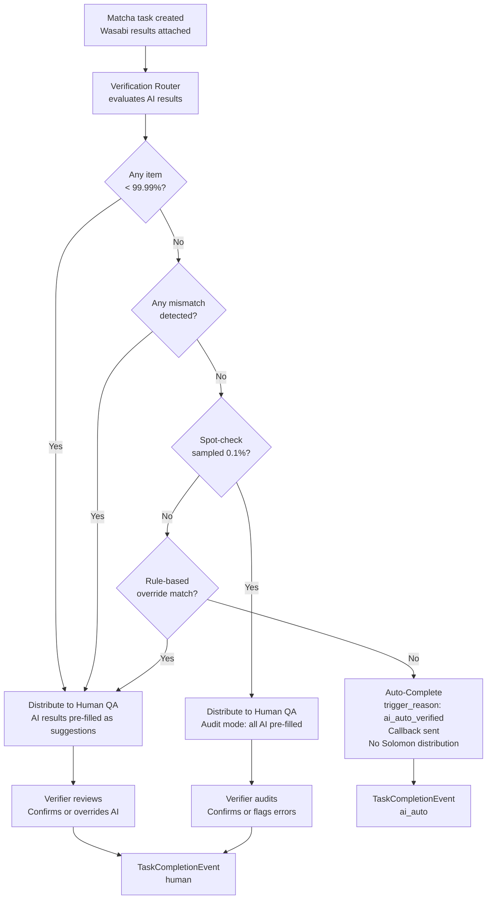

# Capability: AI-First Verification

**Product**: Matcha — [PRODUCT](../../PRODUCT.md)
**Portfolio**: Operations
**Product Owner**: TBD (Operations PO)
**Status**: 📝 Draft — @FEATURE decomposition pending
**Last Updated**: 2026-03-04

---

## Business Function

Use Wasabi's LLM-based verification results as the primary verification path for Matcha tasks — routing tasks to auto-complete when AI confidence is high, routing to human QA when uncertain, and maintaining full audit trail and spot-check sampling for all paths. Human QA verifiers act as fallback for uncertain tasks and as auditors for spot-checked confident tasks.

## Why It Exists (First Principles)

- **QA Headcount Reduction**: QA verifiers are a scaling bottleneck. At high volumes, hiring more verifiers is not economically sustainable. AI auto-verification reduces human touches proportionally to AI confidence rate.
- **Speed**: Wasabi processes documents asynchronously on upload — before the Matcha task even exists. By the time a task reaches Matcha, results are ready. AI-confident tasks can be completed in seconds.
- **Error Prevention**: Document type mismatches and data discrepancies caught at upload time (Phase 1 in Onigiri) mean fewer errors reaching Matcha.
- **Full Audit Trail**: All tasks — AI auto-completed and human-reviewed — must flow through Matcha for a complete, immutable record. No bypass path.

---

## Feature Inventory

| Feature | Status | Description |
|---------|--------|-------------|
| Verification Router | Draft | Evaluates Wasabi AI results attached to task creation payload; determines routing path |
| AI Auto-Complete | Draft | For fully confident tasks: creates TaskCompletionEvent with trigger_reason: ai_auto_verified; sends callback; no Solomon distribution |
| Human QA Distribution (AI-assisted) | Draft | For uncertain tasks: distributes to Solomon with AI results pre-filled as suggestions |
| Spot-Check Sampling | Draft | Randomly samples configurable % (default 0.1%) of AI-confident tasks for human audit |
| Spot-Check Audit Mode | Draft | Sampled tasks shown to verifier with all AI decisions pre-filled; verifier confirms or flags |
| Override Tracking | Draft | Every verifier override of an AI suggestion recorded with context for model retraining pipeline |

---

## Business Rules

### Verification Router Rules (Priority Order)

| Priority | Rule | Action | Use Case |
|----------|------|--------|----------|
| 1 | ANY item confidence < 99.99% | **Distribute to Human QA** | AI is uncertain — human must verify |
| 2 | ANY mismatch detected by Wasabi | **Distribute to Human QA** | Data doesn't match — human must review |
| 3 | Random spot-check sample (default 0.1%) | **Distribute to Human QA** | Audit AI accuracy on confident tasks |
| 4 | Rule-based override *(future)* | **Distribute to Human QA** | High-value, high-risk, or flagged applications |
| 5 | All items ≥ 99.99% + not sampled + no rule match | **Auto-Complete** | AI-verified, no human needed |

### Confidence Threshold Rule

The confidence threshold for AI auto-verification is **99.99%** — ultra-conservative to minimize false positives. Any item below this threshold routes the entire task to human QA.

This means: a single uncertain item on a single document routes the **entire task** to human QA — not just that document.

### Auto-Complete Rules

When Auto-Complete triggers:
- Matcha creates an immutable TaskCompletionEvent with `trigger_reason: ai_auto_verified`
- Webhook callback sent to client with outcome derived from AI results
- No `work-entry` published to Solomon — task never appears in QA worklist
- Full audit trail preserved: task + documents + AI results + completion event in Matcha DB

### Spot-Check Rules

- Sampling rate configurable (default: 0.1% of AI-confident tasks)
- Rate stored as system configuration — adjustable without code change
- Spot-checked tasks visually marked in QA UI: "AI Audit — Verify AI decisions"
- Spot-check tasks provide ground truth for measuring AI false positive rate in production

### Override Tracking Fields

Every verifier override of an AI suggestion records: `aiSuggestion`, `aiConfidence`, `verifierDecision`, `overrideReason`. This data feeds the model improvement pipeline for Wasabi retraining.

### Human QA UI Rules (AI-Assisted Mode)

- High-confidence AI items: pre-filled as `correct` — verifier can confirm or override
- Low-confidence / mismatched items: highlighted for verifier attention
- AI-Extracted Value shown alongside System Value for comparison
- In spot-check audit mode: all AI decisions pre-filled; verifier's role is to audit — confirm or flag errors

---

## Verification Routing Flow

---

## NFRs

| NFR | Requirement |
|-----|-------------|
| All tasks through Matcha | No bypass path — AI auto-completed tasks still create a TaskCompletionEvent in Matcha |
| Confidence threshold enforcement | 99.99% is the system threshold; any item below routes entire task to human QA |
| Spot-check rate configurability | Default 0.1%; adjustable via system configuration without code change |
| Override data pipeline | Every verifier override stored with full context for model retraining |

---

## Open Questions

- What is the fallback behavior if Wasabi results are missing from the task creation payload (e.g., Wasabi was unavailable during the underwriter phase)?
- Should the spot-check sampling rate be configurable per client system (e.g., different rate for Insurance vs. Loans)?
