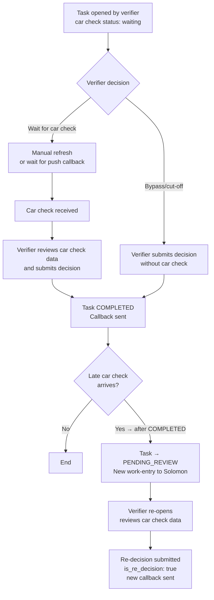

# Capability: Async Car Check Integration

**Product**: Matcha — [PRODUCT](../../PRODUCT.md)
**Portfolio**: Operations
**Product Owner**: TBD (Operations PO)
**Status**: ✅ Active — @FEATURE decomposition pending
**Last Updated**: 2026-03-04

---

## Business Function

Support complex verification flows where vehicle data must be cross-referenced with external vehicle databases (car check providers) that may have significant latency — without blocking QA verifiers or creating a stale waiting state.

## Why It Exists (First Principles)

- **External Dependency Latency**: Car check providers may take seconds to minutes to respond. Blocking QA verifiers on an external system response would grind throughput to a halt.
- **Late Data Reality**: Car check results may arrive after the verifier has already made a decision. The system must handle post-decision data arrival gracefully without silently ignoring new data.
- **Bypass Requirement**: Operations cannot always wait. If the provider is slow or unresponsive, verifiers must be able to submit their decision and unblock the loan workflow — with the system handling any late data arrival automatically.

---

## Feature Inventory

| Feature | Status | Description |
|---------|--------|-------------|
| Manual Refresh Trigger | Live | Verifier can manually trigger a "Refresh" to pull latest car check data |
| Push Callback Listener | Live | System listens for push callbacks from car check providers and updates task data automatically |
| Car Check Status Display | Live | UI shows car check status: none → waiting → received with visual indicators |
| Bypass with Cut-off | Live | Verifier can bypass waiting for car check and submit decision; system unblocks immediately |
| Late Data PENDING_REVIEW | Live | If car check arrives after COMPLETED, task transitions to PENDING_REVIEW with new work-entry to Solomon |
| Re-decision with Full Authority | Live | On PENDING_REVIEW re-entry, verifier retains full authority to Refer, Return, or Approve |

---

## Business Rules

### Car Check Status Values

| Status | Meaning |
|--------|---------|
| `none` | Car check not yet requested |
| `waiting` | Request sent to provider; awaiting response |
| `received` | Car check data received and available for verification |

### Bypass Rules

- A verifier can submit a decision even when car check status is `waiting`
- Bypass is immediate — the callback fires immediately, unblocking the loan origination workflow
- There is **no** separate `awaiting_car_check` state in the task lifecycle — bypass is always available

### Late Data Handling Rules

| Scenario | Action |
|----------|--------|
| Car check data arrives while task is IN_PROGRESS | Update task data; "Revised" alert shown on next load |
| Car check data arrives while task is COMPLETED | Task transitions to PENDING_REVIEW; new work-entry published to Solomon |
| On PENDING_REVIEW re-entry | Verifier sees car check data; full authority to change or confirm decision |

### Re-decision Rules

- A new TaskCompletionEvent is created for the re-decision with `is_re_decision: true`
- A new webhook callback is sent to the client with the updated outcome and `isReDecision: true`
- The original TaskCompletionEvent is never mutated

---

## User Flow

---

## NFRs

| NFR | Requirement |
|-----|-------------|
| No blocking state | No `awaiting_car_check` state in task lifecycle — bypass always available |
| Late data handling | Car check arriving after COMPLETED must trigger PENDING_REVIEW automatically |
| Re-decision audit | New TaskCompletionEvent created for re-decision; original never mutated |
