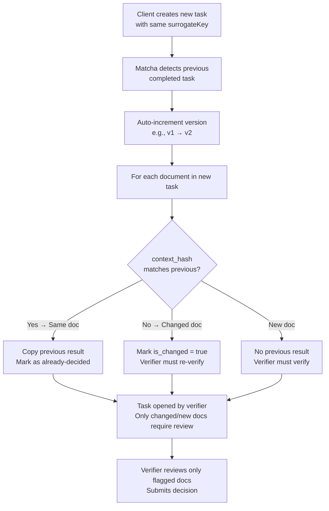

# Capability: Re-flow

**Product**: Matcha — [PRODUCT](../../PRODUCT.md)
**Portfolio**: Operations
**Product Owner**: TBD (Operations PO)
**Status**: ✅ Active — @FEATURE decomposition pending
**Last Updated**: 2026-03-04

---

## Business Function

When a returned task re-enters the system (e.g., a loan application was returned and documents were corrected), minimize redundant re-work for QA verifiers by automatically detecting which documents changed and copying previous decisions for unchanged documents.

## Why It Exists (First Principles)

- **Re-work Cost**: When an application is RETURNED and resubmitted, the vast majority of documents are unchanged — only the documents that caused the return are re-uploaded. Without re-flow, verifiers must re-verify every document, wasting time on already-verified content.
- **Traceability**: Re-flows must be linked to their previous version for audit — verifiers and auditors must be able to see that "this document was already verified in version 1 and has not changed."

---

## Feature Inventory

| Feature | Status | Description |
|---------|--------|-------------|
| Same Surrogate Key Detection | Live | When a new task is created with the same surrogateKey, Matcha detects the previous completed task |
| Version Auto-increment | Live | New task version incremented from previous (v1 → v2 → v3) |
| Smart Result Copy | Live | Documents with matching context_hash (same data + files as previous version) have their previous results copied; shown as already-decided |
| Change Flagging | Live | Documents with different context_hash marked is_changed = true; verifier must re-verify only these |
| Previous Version Linking | Live | Each document links to previous_document_id from prior version for traceability |

---

## Business Rules

### Re-flow Detection

| Condition | Action |
|-----------|--------|
| New task created with same `surrogateKey` as a COMPLETED task | Re-flow triggered; new version created |
| Same `surrogateKey` as an IN_PROGRESS task | Conflict; must be handled (existing task must be completed or cancelled first) |

### Smart Result Copy Rules

| Document Condition | Action |
|-------------------|--------|
| `context_hash` matches previous version | Previous verification result copied; document shown as already-decided to verifier |
| `context_hash` differs from previous version | Document marked `is_changed = true`; verifier must re-verify |
| New document (no previous version) | Document shown as not-yet-verified; verifier must verify |

### Version Rules

- Version numbers are integers, auto-incremented per surrogateKey
- Version 1 = original task; Version 2+ = re-flow
- All versions linked via surrogateKey for audit trail
- `previous_document_id` on each document links to the corresponding document from the previous version

---

## User Flow

---

## NFRs

| NFR | Requirement |
|-----|-------------|
| No duplicate verification | Unchanged documents (matching context_hash) must not require re-verification |
| Version traceability | All versions of a surrogateKey linked and auditable |
| previous_document_id completeness | Every document in a re-flow task must link to its previous version document (if exists) |
