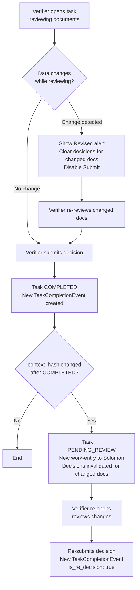

# Capability: Safety & Integrity Guardrails

**Product**: Matcha — [PRODUCT](../../PRODUCT.md)
**Portfolio**: Operations
**Product Owner**: TBD (Operations PO)
**Status**: ✅ Active — @FEATURE decomposition pending
**Last Updated**: 2026-03-04

---

## Business Function

Guarantee that every verification decision is based on the current state of the data — preventing "approval leakage" where a document is approved but the underlying data or file was subsequently modified. Achieves this through dual-hash change detection, visual alerts, decision invalidation, and an immutable audit trail.

## Why It Exists (First Principles)

- **Approval Leakage Risk**: Without change detection, a document could be approved and then silently modified (new file uploaded, data updated) after the verifier's decision. The approved decision would be associated with data the verifier never saw.
- **Audit Trail Immutability**: Financial and regulatory compliance requires that every verification decision be traceable and unalterable. Mutating historical decisions is a data integrity violation.
- **Re-decision Traceability**: When a verifier changes a decision (during PENDING_REVIEW), both the original and the updated decision must be preserved for audit.

---

## Feature Inventory

| Feature | Status | Description |
|---------|--------|-------------|
| Dual-Hash Change Detection | Live | SHA-256 hash of document data + file URLs (context_hash) compared against hash at decision time (decision_hash) |
| Revised Alert (Visual) | Live | UI highlights changed documents with a "Revised" box; shows exactly which documents changed since last decision |
| Pre-filled Decision Clearing | Live | When change detected mid-review, pre-filled decisions on changed documents are cleared; submit disabled until re-reviewed |
| Post-Completion Change Detection | Live | If context_hash changes after COMPLETED, task transitions to PENDING_REVIEW automatically |
| Immutable TaskCompletionEvent | Live | Every COMPLETED transition creates an immutable audit event; re-decisions create new events with is_re_decision: true |

---

## Business Rules

### Hash Model

| Hash | Calculated From | When Updated |
|------|----------------|-------------|
| `context_hash` | SHA-256 of document `data` (jsonb) + `file_urls` | Recalculated on any data or file URL change |
| `decision_hash` | Snapshot of `context_hash` at time verifier made their decision | Captured at the moment the verifier decides |

### Change Detection Rules

| Scenario | Condition | Action |
|----------|-----------|--------|
| Mid-review change | context_hash ≠ decision_hash while task is IN_PROGRESS | Show "Revised" alert; clear pre-filled decisions for changed docs; disable Submit until re-reviewed |
| Post-completion change | context_hash ≠ decision_hash while task is COMPLETED | Transition task to PENDING_REVIEW; publish new work-entry to Solomon |

### TaskCompletionEvent Immutability Rules

- Every transition to COMPLETED creates a new immutable TaskCompletionEvent
- Fields recorded: outcome, submitted_by, trigger_reason (`human`, `ai_auto_verified`, `human_audit`), callback_status, is_re_decision
- If a verifier changes decision during PENDING_REVIEW: a **new** event is created with `is_re_decision: true`
- The original event is **never** mutated or deleted
- Re-decisions are fully auditable: original outcome + re-decision outcome both visible in audit trail

---

## User Flow

---

## NFRs

| NFR | Requirement |
|-----|-------------|
| Hash freshness | context_hash must be recalculated on every data or file URL change |
| Immutable events | TaskCompletionEvents must never be updated or deleted — append only |
| Audit completeness | Every verification decision (original + re-decision) traceable via TaskCompletionEvent chain |
