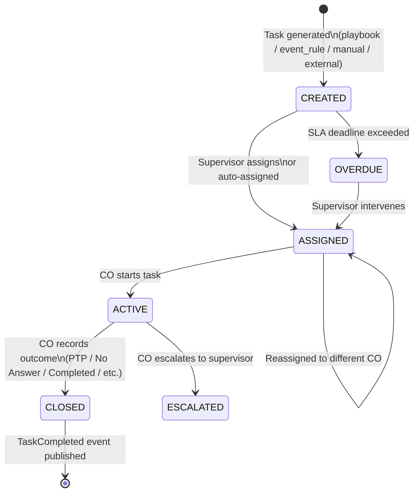
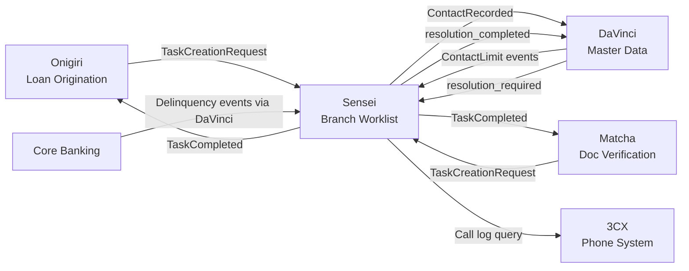

# Product: Branch Operations Orchestration

**Codename**: Sensei (先生)
**Portfolio**: Operations → [PORTFOLIO](../../PORTFOLIO.md)
**Status**: 📝 Draft
**Executive Owner**: COO / Head of Branch Operations
**Last Updated**: 2026-03-04

> *Sensei (先生) — The master who provides structure, guidance, and discipline. Sensei does not do the work — it orchestrates how work is done across branches, ensuring alignment with policy, visibility for leadership, and productivity for field staff.*

---

## Problem Statement

Branch field staff work across multiple products and systems (Onigiri for loans, Matcha for document tasks, delinquency systems for collections). Without a centralized worklist, COs must context-switch between systems to find their next action, resulting in missed tasks, inconsistent follow-up, and no unified accountability. Supervisors have no consolidated view of team throughput, contact compliance status, or exception alerts. Institutional knowledge about collection strategies exists as tribal knowledge, not executable playbooks.

---

## Value Proposition

A centralized branch worklist and task orchestration platform. Aggregates all branch work — from Sensei's own playbook-driven tasks, to external service requests (Onigiri, Matcha), to supervisor-created manual tasks — into a single prioritized queue with SLA tracking, gamified performance dashboards, contact compliance enforcement, and action verification.

**For whom**: Branch Credit Officers (COs) who execute daily work; Branch Supervisors who manage team performance and compliance; HQ who defines collection playbooks and compliance-locked strategies.

---

## Product Boundary

**This product IS responsible for:**
- Playbook Engine: HQ System Templates → Branch Variant model, compliance-locked steps, outcome-based transition routing, template version sync
- Task Engine: unified task lifecycle (CREATED → ASSIGNED → ACTIVE → CLOSED), event-driven task generation from DaVinci/Core Banking/Policy Admin, external task creation contract (TaskCreationRequest), task completion feedback (TaskCompleted)
- Work Queue: grouped action buckets (Calls/Visits/Admin/External), priority sub-groups, one-by-one primary processing mode, rapid-fire extended mode
- Performance & Visibility Dashboard: supervisor team workload + exception alerts; staff self-service metrics + gamified leaderboard
- Contact compliance **signal consumption** (subscribes to DaVinci events: ContactLimitReached, ContactLimitApproaching, ContactWindowClosed)
- Action verification: 3CX call log cross-check, verification status (Verified/Unverified/Mismatch)
- Template Library: HQ-owned action type definitions, typed outcomes, required fields, SLA defaults, escalation rules

**This product IS NOT responsible for:**
- Contact compliance **data ownership** — contact log, frequency limits, cross-product aggregation (owned by **DaVinci**)
- Loan workflow orchestration, application state management (owned by **Onigiri**)
- Document verification logic or QA workflow (owned by **Matcha**)
- Customer master data and Golden Record (owned by **DaVinci**)
- ResolutionRequest lifecycle state — Sensei creates and completes tasks, DaVinci owns the resolution state (owned by **DaVinci**)

**This product RECEIVES from:**
- DaVinci → ContactLimitReached, ContactLimitApproaching, ContactWindowClosed events → via event subscription
- DaVinci → customer.resolution_required events (creates Admin tasks for COs) → via event subscription
- Onigiri → TaskCreationRequest events when loan workflow needs branch action → via event
- Matcha → TaskCreationRequest events when doc verification needs branch action → via event
- Core Banking / Policy Admin → delinquency and renewal events (via DaVinci event rules) → via event

**This product SENDS to:**
- DaVinci → ContactRecorded event after each contact task completion → via event
- DaVinci → customer.resolution_completed event after resolution tasks → via event
- Onigiri → TaskCompleted event with outcome, completed_by, source_ref_id → via event
- Matcha → TaskCompleted event with outcome → via event
- 3CX → call log verification query → via API

---

## Capability Registry

| Capability | Owner | Status | Description |
|-----------|-------|--------|-------------|
| [Playbook Engine](capabilities/playbook-engine/CAPABILITY.md) | Product | Draft | HQ System Templates + Branch Variant fork model. Compliance-locked steps (🔒). Outcome-based transition routing per step. Drag-and-drop step reordering for supervisors. Template version sync. |
| [Task Engine](capabilities/task-engine/CAPABILITY.md) | Engineering | Draft | Unified task lifecycle (CREATED → ASSIGNED → ACTIVE → CLOSED + OVERDUE + ESCALATED). 4 task sources: playbook_step, event_rule, manual, external. External task creation contract (TaskCreationRequest). TaskCompleted feedback events. |
| [Work Queue](capabilities/work-queue/CAPABILITY.md) | Engineering | Draft | Grouped action buckets (Calls/Visits/Admin). Priority sub-groups (Overdue > High DPD > Normal). One-by-one primary mode. Rapid-fire extended mode. Daily contact limit enforcement. |
| [Performance Dashboard](capabilities/performance-dashboard/CAPABILITY.md) | Product | Draft | Supervisor view: team workload table, active playbooks, exception panel (5 alert types), daily scorecard, contact compliance status. Staff view: personal metrics, monthly objectives, branch rank, gamified leaderboard, supervisor feedback. |
| [Contact Compliance](capabilities/contact-compliance/CAPABILITY.md) | Engineering | Draft | Subscribes to DaVinci compliance events. Auto-skips tasks when ContactLimitReached. Shows warning badge when ContactLimitApproaching. Blocks contact tasks outside ContactWindowClosed. Does NOT own contact log data. |
| [Template Library](capabilities/template-library/CAPABILITY.md) | Product | Draft | HQ-owned action type definitions. Typed outcomes per action. Required fields per outcome (e.g., PTP → amount + date). SLA defaults. Escalation rules (e.g., 3 failed calls → escalate to Visit). |

---

## Task Lifecycle

---

## Integration Map

---

## Product-Level Metrics and KPIs

| Metric | Description | Target |
|--------|-------------|--------|
| CO Daily Throughput | Avg. tasks completed per CO per day | > 350 |
| Contact Compliance Rate | % of days with zero contact limit violations per branch | 100% |
| SLA Breach Rate | % of tasks that expire OVERDUE without supervisor intervention within 4 hours | < 5% |
| Playbook Completion Rate | % of initiated playbooks that reach End (Success) vs. End (Failed) | Track per playbook type |
| Action Verification Rate | % of Call tasks with Verified status from 3CX cross-check | > 95% |

---

## Detailed Reference

For full capability specifications, playbook design decisions, and integration contracts, see: [ATLAS.md](ATLAS.md)
