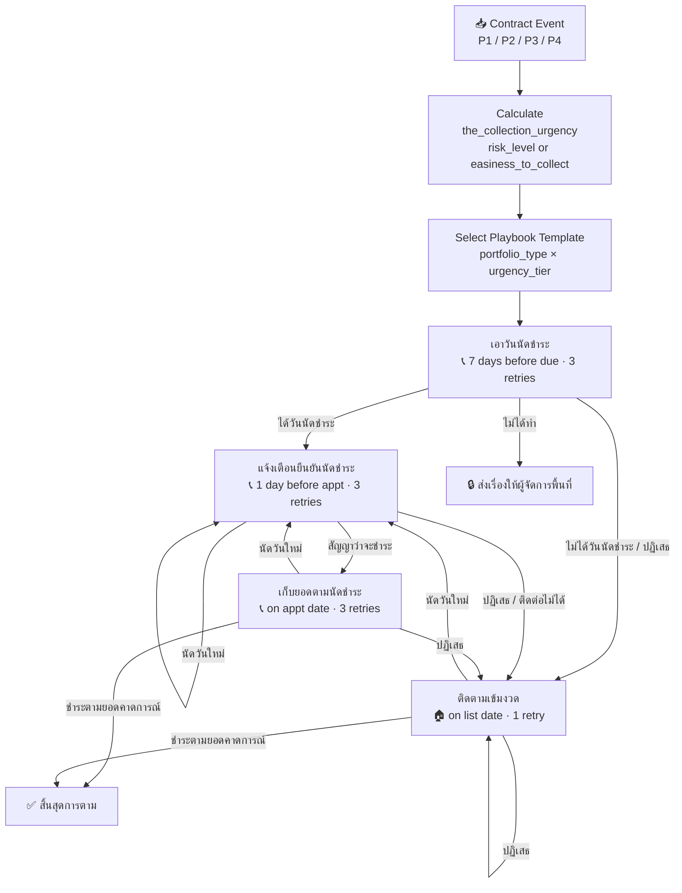

# Capability: Playbook Engine

**Product**: Sensei — [PRODUCT](../../PRODUCT.md)
**Portfolio**: Operations
**Product Owner**: TBD (Operations PO)
**Status**: 📝 Draft — @FEATURE decomposition pending
**Last Updated**: 2026-03-04

---

## Business Function

Provide a structured, reusable system for defining multi-step operational strategies (Playbooks) that drive how field staff handle specific collection objectives. Playbooks are triggered by priority-classified events, configured per portfolio type and collection urgency, and organized into a sequential 4-stage Objective Chain. Each stage leads to the next unless the contract reaches an end condition (full payment, restructure, or repossession).

## Why It Exists (First Principles)

- **Policy Alignment**: Thousands of branch staff across hundreds of branches must execute consistent strategies. Without structured playbooks, each branch invents its own approach, causing inconsistent outcomes and compliance risk.
- **Knowledge Codification**: Effective collection strategies are institutional knowledge. Playbooks capture this as executable templates, not tribal knowledge.
- **Urgency-Aware Execution**: Not all contracts are equal. The intensity of follow-up (timing, action type, retry count) must reflect how urgent collection is for that specific contract — driven by risk level and portfolio type.
- **Adaptability**: HQ defines the default strategy per urgency tier, but local conditions require branch-level customization within guardrails.

---

## Feature Inventory

| Feature | Status | Description |
|---------|--------|-------------|
| Event Trigger Processor | Draft | Classifies incoming contract events by priority and routes to the correct playbook objective |
| Collection Urgency Calculator | Draft | Computes `the_collection_urgency` from `risk_level` (active) or `easiness_to_collect` (write-off) |
| Playbook Objective Chain | Draft | Manages the 4-stage chain (เอาวันนัดชำระ → แจ้งเตือนฯ → เก็บยอดฯ → ติดตามเข้มงวด); advances or terminates based on outcomes |
| Playbook Builder (HQ) | Draft | HQ creates System Templates per portfolio type + urgency tier, with step sequences, action types, timing, outcome transitions, and compliance locks |
| Branch Variant Fork | Draft | Supervisors fork a System Template into a Branch Variant with drag-and-drop step editing within allowed rules |
| Compliance Lock Enforcement | Draft | Locked steps (🔒) cannot be removed, reordered past their boundary, or have outcome transitions modified |
| Outcome Transition Router | Draft | Each step defines per-outcome transitions (Next Objective / Specific Step / Retry / End Chain / Escalate) |
| Template Version Sync | Draft | HQ publishes new template version; branches with variants notified to review and merge changes |
| Playbook Instantiation | Draft | When a playbook objective is triggered for a contract, step tasks are created atomically in the Task Engine |

---

## Configuration Ownership

All business logic components of the Playbook Engine are **fully configurable** — they can be added to, adjusted, or changed by the appropriate role. The only fixed element is the **Objective Configurations structure** (its columns/schema), which is system-defined and immutable.

| Component | Add | Adjust | Change | Who |
|-----------|-----|--------|--------|-----|
| Priority Tiers | ✅ | ✅ | ✅ | HQ |
| Events per Priority | ✅ | ✅ | ✅ | HQ |
| `the_collection_urgency` mapping & thresholds | ✅ | ✅ | ✅ | HQ |
| Objectives (names, sequence, number of stages) | ✅ | ✅ | ✅ | HQ |
| Outcome Routing per Objective | ✅ | ✅ | ✅ | HQ |
| Playbook Templates (per portfolio_type × urgency_tier) | ✅ | ✅ | ✅ | HQ |
| Branch Variants | ✅ | ✅ | ✅ | AM and above |
| Objective Configurations **values** (timing, lifespan, action) | ✅ | ✅ | ✅ | HQ (defaults) / AM+ (within HQ limits) |
| Objective Configurations **structure** (columns/schema) | ❌ | ❌ | ❌ | System-defined — immutable |

> The Objective Configurations structure defines the **fields** each Objective must have: `วันที่สร้างงาน`, `อายุของงาน`, `Action ที่แนะนำ`, `จำนวนทำซ้ำ`. This schema is fixed. The **values** within those fields are fully configurable per role.

---

## Business Rules

### 1. Event Triggers by Priority

Every contract event that enters Sensei is classified into one of four priority tiers. Priority determines queue ordering in the Work Queue and which playbook objective is activated.

| Priority | Event | Meaning |
|----------|-------|---------|
| **P1** | สัญญาถึงวันครบกำหนดชำระ | Contract is at its due date today |
| **P1** | สัญญาที่มีนัดชำระในวันนี้ | Contract has a scheduled payment appointment today |
| **P2** | สัญญาใกล้วันครบกำหนดชำระ | Contract approaching due date (pre-due window) |
| **P2** | แจ้งเตือนก่อนนัดชำระ | Reminder before a scheduled payment appointment |
| **P3** | ไม่มีวันนัดชำระ | Contract has no payment appointment set |
| **P3** | ตัวที่หลุด | Contract missed a previous payment commitment |
| **P4** | Write Off | Contract classified as write-off; transferred to write-off portfolio |

**Rule**: Higher priority events surface first in the CO's Work Queue within each action bucket. Within the same priority, contracts are sorted by `the_collection_urgency` (highest urgency first).

---

### 2. Collection Urgency Scoring

`the_collection_urgency` is calculated per contract and determines which playbook template configuration applies. It is derived from the portfolio type:

| Portfolio Type | Input Dimension | Scale | Priority Order | Interpretation |
|----------------|----------------|-------|----------------|----------------|
| **Active** | `risk_level` | 1 – 6 | Higher score first | 1 = lowest risk; 6 = highest risk / most delinquent — collect highest risk first |
| **Write-Off** | `easiness_to_collect` | 1 – 7 | Higher score first | 7 = easiest to collect; 1 = hardest to collect — collect easiest first to maximize recovery rate |

**Default sort order**: Within the same priority tier, contracts are sorted by **descending score** for both portfolios. For Write-Off, a score of 7 is the highest collection priority (easiest to recover); a score of 1 is the lowest (hardest to recover). This is the inverse of Active's risk interpretation but follows the same descending sort rule.

`the_collection_urgency` maps these scores to a playbook template variant. Higher urgency = more aggressive timing, lower retry tolerance, and earlier escalation to Visit.

> **Design note**: The mapping from `risk_level` / `easiness_to_collect` to urgency tiers (and thus to template variants) is configured by HQ in the Template Library. Sensei applies the mapping — it does not define the business thresholds.

---

### 3. Playbook Objective Chain

Collection for a contract follows a sequential chain of four Objectives. Each Objective is a self-contained playbook stage. Completing one Objective advances to the next. The chain terminates only when an End Condition is met.

```
┌──────────────────────┐
│  เอาวันนัดชำระ        │  ← Triggered by P2 events (สัญญาใกล้ due / ไม่มีนัดชำระ)
└──────────┬───────────┘
           │ ได้วันนัดชำระ
┌──────────▼───────────┐
│  แจ้งเตือนยืนยัน      │  ← Triggered 1 day before appointment
│  นัดชำระ             │
└──────────┬───────────┘
           │ สัญญาว่าจะชำระ
┌──────────▼───────────┐
│  เก็บยอดตาม           │  ← Triggered on appointment date
│  นัดชำระ             │
└──────────┬───────────┘
           │ ไม่ชำระ / ปฏิเสธ
┌──────────▼───────────┐
│  ติดตามเข้มงวด        │  ← Triggered when contract enters strict follow-up list
└──────────┬───────────┘
           │ outcomes route back up the chain or end
           ▼
    END CONDITIONS (see below)
```

**Chain transition rules:**
- Any Objective can route to `ติดตามเข้มงวด` if the contract fails to produce a payment commitment.
- `ติดตามเข้มงวด` can route back to `แจ้งเตือนยืนยันนัดชำระ` if a new appointment date is obtained.
- The chain does NOT restart from `เอาวันนัดชำระ` once an appointment exists.

---

### 4. Objective Configurations

**Ownership split:**
- **HQ defines**: the 4 Objective names, their sequence, and the default values for all parameters
- **Supervisor (AM and above) can adjust**: `วันที่สร้างงาน` (creation trigger offset), `อายุของงาน` (task lifespan), and `Action ที่แนะนำ` — within limits set by HQ per urgency tier

| Objective | วันที่สร้างงาน (default) | อายุของงาน (default) | Action ที่แนะนำ (default) | จำนวนทำซ้ำ |
|-----------|------------------------|---------------------|--------------------------|------------|
| เอาวันนัดชำระ | ก่อน due 7 วัน | 7 วัน | 📞 โทร | 3 ครั้ง |
| แจ้งเตือนยืนยันนัดชำระ | ก่อนวันนัดชำระ 1 วัน | ภายในวัน | 📞 โทร | 3 ครั้ง |
| เก็บยอดตามนัดชำระ | วันนัดชำระ | ภายในวัน | 📞 โทร | 3 ครั้ง |
| ติดตามเข้มงวด | วันที่ list ขึ้น | 3 วัน | 🏠 ลงพื้นที่ | 1 ครั้ง |

> Higher urgency tiers may have tighter `อายุของงาน` defaults or earlier escalation to Visit in the HQ template. Supervisors adjust within those HQ-set bounds.

---

### 5. Outcome Routing per Objective

#### เอาวันนัดชำระ

| ผลลัพธ์ | ขั้นตอนถัดไป |
|--------|-------------|
| ได้วันนัดชำระ | → แจ้งเตือนยืนยันนัดชำระ |
| ไม่ได้วันนัดชำระ | → ติดตามเข้มงวด |
| ปฏิเสธการชำระ | → ติดตามเข้มงวด |
| ไม่ได้ทำ (หมดอายุ) | → 🔒 ส่งเรื่องให้ผู้จัดการพื้นที่ — **no new task created**; contract is moved into AM's responsible contract list (สัญญาที่อยู่ภายใต้การดูแลของพื้นที่). AM decides whether to assign back to original branch, reassign to another branch, or handle directly. |

#### แจ้งเตือนยืนยันนัดชำระ

| ผลลัพธ์ | ขั้นตอนถัดไป |
|--------|-------------|
| สัญญาว่าจะชำระ | → เก็บยอดตามนัดชำระ |
| ปฏิเสธการชำระ | → ติดตามเข้มงวด |
| นัดวันชำระใหม่ | → แจ้งเตือนยืนยันนัดชำระ (re-trigger on new date) |
| ติดต่อไม่ได้ | → ติดตามเข้มงวด |

#### เก็บยอดตามนัดชำระ

| ผลลัพธ์ | ขั้นตอนถัดไป |
|--------|-------------|
| ชำระตามยอดคาดการณ์ | → **สิ้นสุดการตาม** (End Chain ✅) |
| ปฏิเสธการชำระ | → ติดตามเข้มงวด |
| นัดวันชำระใหม่ | → แจ้งเตือนยืนยันนัดชำระ (re-trigger on new date) |

#### ติดตามเข้มงวด

| ผลลัพธ์ | ขั้นตอนถัดไป |
|--------|-------------|
| ชำระตามยอดคาดการณ์ | → **สิ้นสุดการตาม** (End Chain ✅) |
| ปฏิเสธการชำระ | → ติดตามเข้มงวด (re-queue) |
| นัดวันชำระใหม่ | → แจ้งเตือนยืนยันนัดชำระ |

---

### 6. End Conditions

The playbook chain terminates for a contract when any of the following conditions are met:

| Condition | Trigger | Status |
|-----------|---------|--------|
| ชำระตามยอดตามคาดการณ์ | CO records full payment matching forecasted amount | ✅ End Chain (Success) |
| Restructure | Contract restructured (terms renegotiated) | ✅ End Chain (Success) — TBD |
| Repossession | Asset repossessed | ✅ End Chain (Closed) — TBD |

> **Note**: Restructure and Repossession end conditions and their triggering events are to be defined in a future iteration.

---

### 7. Step Action Types

| Action Type | Icon | Possible Outcomes |
|-------------|------|------------------|
| Call | 📞 | PTP, No Answer, Refused, Callback, Wrong Number, Line Busy, Voicemail |
| Visit | 🏠 | Met Customer, Not Home, Address Invalid, PTP (in-person), Refused |
| Admin | 📋 | Completed, Incomplete, Escalated |
| Wait | ⏳ | Auto-advances after duration (no manual outcome) |
| Notify Supervisor | 🔔 | Acknowledged, No Response |
| Send Notification | 📧 | Auto-dispatched; Delivered / Failed |

### 8. Outcome Transition Types

| Transition | Meaning |
|-----------|---------|
| `→ Next Objective` | Advance to the next stage in the Objective Chain |
| `→ Specific Objective` | Jump to a named objective (e.g., skip directly to ติดตามเข้มงวด) |
| `→ Retry` | Repeat same step with max attempt limit |
| `→ End Chain (Success)` | Contract fully resolved — remove from active worklist |
| `→ End Chain (Failed)` | Chain exhausted without resolution — escalate or write off |
| `→ Escalate` | Route to supervisor for manual decision |
| `→ Re-trigger` | Re-trigger the same objective on a new date (e.g., new appointment) |

### 9. Playbook Hierarchy

| Level | Owner | Can Edit? |
|-------|-------|-----------|
| System Template | HQ | Action types: HQ only. Timing and deadlines: AM and above |
| Branch Variant | AM and above | Yes, within allowed edit rules |

System Templates are organized by `portfolio_type` × `urgency_tier` but are **not strictly one-to-one** — the same template can be assigned to multiple combinations if the strategy is identical. HQ manages which template applies to which combination. Branches (AM role and above) fork Branch Variants from those templates, and can adjust timing and deadlines within HQ-set limits.

### 10. Supervisor Edit Rules

| Allowed | Not Allowed |
|---------|-------------|
| Reorder steps within an Objective (drag and drop) | Delete 🔒 locked steps |
| Drag outcome transitions to different target steps | Edit System Templates directly |
| Add optional steps | Remove audit trail / compliance logging |
| Add/remove outcomes on non-locked steps | Modify outcome transitions on 🔒 locked steps |
| Adjust timing (within HQ-set limits) | Reorder locked steps past their compliance boundary |
| Change assignee rules | Bypass publishing workflow |
| Set retry limits on outcomes | Modify urgency-tier assignments |
| Remove non-locked steps | |

### 11. Compliance-Locked Steps

Locked steps (🔒) are mandated by HQ for legal or operational compliance:
- Cannot be removed from the playbook
- Cannot be reordered past a defined boundary
- Timing adjustable only within limits set by HQ
- Outcome transitions visible but not modifiable by supervisors
- Applies within an Objective's steps; Objective Chain ordering is system-managed, not supervisor-editable

---

## Objective Chain Flow Diagram



---

## NFRs

| NFR | Requirement |
|-----|-------------|
| Compliance lock integrity | Locked steps cannot be removed or reordered by any user except HQ |
| Version tracking | Branch variants must track which system template version they were forked from |
| Instantiation atomicity | Playbook instantiation (creating all tasks for an Objective) must be atomic — all tasks created or none |
| Urgency re-evaluation | `the_collection_urgency` is re-evaluated on each event; a contract's urgency tier can change between Objectives |
| No duplicate chain | Only one active Objective Chain per contract at any time; duplicate event triggers must be deduplicated |
| End condition idempotency | End Chain events (full payment, restructure, repossession) must close all active tasks for that contract atomically |
