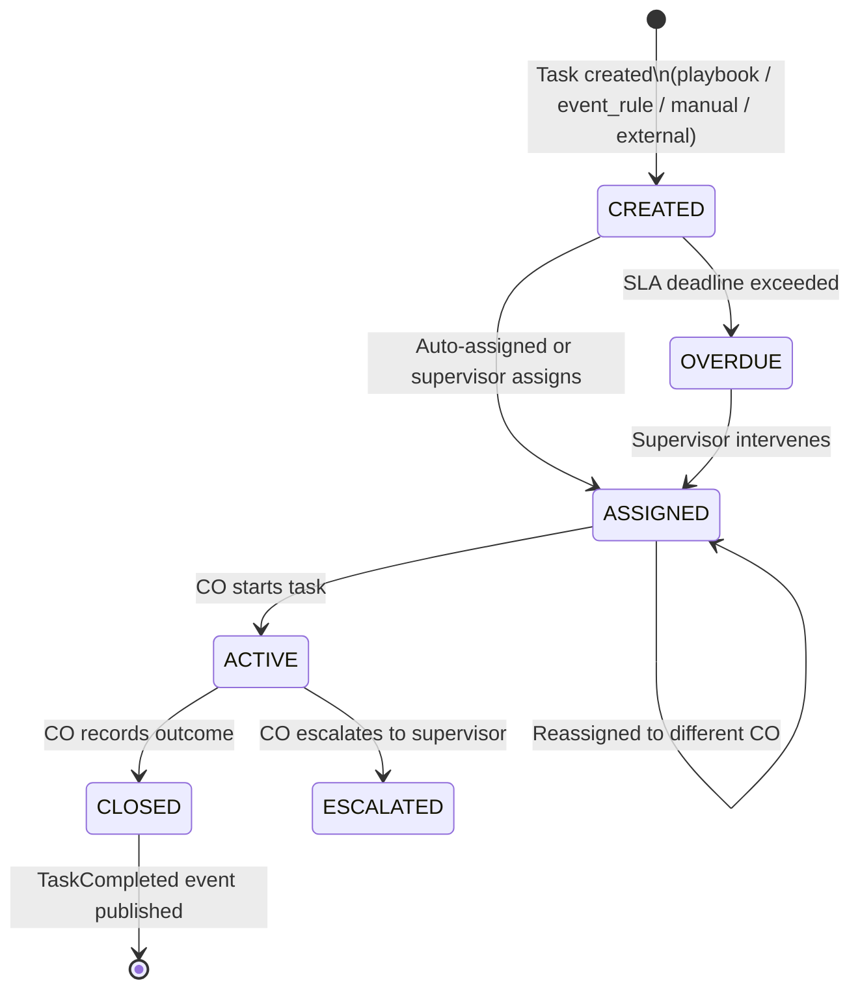

# Capability: Task Engine

**Product**: Sensei — [PRODUCT](../../PRODUCT.md)
**Portfolio**: Operations
**Product Owner**: TBD (Operations PO)
**Status**: 📝 Draft — @FEATURE decomposition pending
**Last Updated**: 2026-03-04

---

## Business Function

Provide a unified task tracking system for branches — aggregating work from Sensei's own playbooks, external service requests (Onigiri, Matcha), event-driven rules, and supervisor-created tasks into a single worklist with lifecycle tracking, SLA enforcement, and outcome recording. Sensei is a **task tracker, not a workflow orchestrator** — domain-specific workflows stay in their own systems.

## Why It Exists (First Principles)

- **Accountability**: Every customer interaction must be recorded. Without task records, there is no audit trail of attempts, outcomes, or compliance adherence.
- **Throughput Visibility**: Management cannot measure what is not tracked. Tasks provide the atomic unit of measurement for staff productivity.
- **Unified Inbox**: Branch staff work across multiple products. Without a centralized worklist, they must switch between Onigiri, Matcha, and other systems. Sensei presents all branch work in one place.
- **Automation**: Tasks generated automatically from events and playbooks eliminate reliance on supervisors manually assigning every piece of work.

---

## Feature Inventory

| Feature | Status | Description |
|---------|--------|-------------|
| Task Lifecycle Manager | Draft | CREATED → ASSIGNED → ACTIVE → CLOSED state machine with OVERDUE and ESCALATED side states |
| External Task Creation Contract | Draft | Consume TaskCreationRequest events from Onigiri, Matcha, and other systems |
| Event-Driven Task Generation | Draft | Internal rules create tasks from DaVinci, Core Banking, Policy Admin events |
| Task Completion Feedback | Draft | Publish TaskCompleted event with outcome, source_ref_id, source_callback for upstream system routing |
| Supervisor Task Controls | Draft | Reassign, override playbook step, add manual task, bulk operations |
| SLA Enforcement | Draft | Transition task to OVERDUE when SLA deadline exceeded; surface in supervisor exception panel |

---

## Business Rules

### Task Sources

| Source | How Created | Example |
|--------|-------------|---------|
| `playbook_step` | Auto by Sensei's Playbook Engine on playbook instantiation | Delinquency playbook generates "Call customer" task |
| `event_rule` | Auto by Sensei's event rules matching incoming events | DPD > 30 → Call task |
| `manual` | Supervisor creates one-off task in UI | "Visit customer for special follow-up" |
| `external` | External service publishes TaskCreationRequest event | Onigiri needs docs collected; Matcha needs physical ID |

### Task Lifecycle States

| State | Meaning |
|-------|---------|
| CREATED | Task generated; awaiting assignment |
| ASSIGNED | CO assigned; not yet started |
| ACTIVE | CO is actively working the task |
| CLOSED | CO recorded outcome; task complete |
| OVERDUE | SLA deadline exceeded while not CLOSED |
| ESCALATED | CO escalated to supervisor for manual decision |

### External Task Creation Contract

```
TaskCreationRequest {
  customer_id        // DaVinci customer ID (required)
  action_type        // call | visit | admin | review (required)
  title              // Human-readable, e.g., "เก็บเอกสาร KYC" (required)
  description        // Context for the CO (optional)
  priority           // high | normal | low (default: normal)
  sla_deadline       // ISO timestamp (optional)
  source_system      // "onigiri" | "matcha" | etc. (required)
  source_ref_id      // e.g., loan_application_id (required)
  source_callback    // event topic for completion notification (optional)
  metadata           // opaque JSON — stored but not interpreted (optional)
}
```

### Task Completion Feedback Contract

```
TaskCompleted {
  task_id             // Sensei task ID
  customer_id         // DaVinci customer ID
  action_type         // what was done
  outcome             // typed outcome (PTP, Completed, Refused, etc.)
  outcome_data        // structured data (e.g., PTP amount + date)
  completed_by        // CO identifier
  completed_at        // ISO timestamp
  source_system       // original source
  source_ref_id       // original reference
  source_callback     // echoed back for routing
  metadata            // echoed back opaque metadata
}
```

### Supervisor Task Control Rules

| Control | Action |
|---------|--------|
| Reassign | Move task from one CO to another |
| Override Playbook Step | Skip or insert a step for a specific customer's playbook instance |
| Add Manual Task | Create one-off task not tied to any playbook |
| Bulk Operations | Reassign all tasks from one CO to another (e.g., staff absence) |

---

## Task Lifecycle Diagram



---

## NFRs

| NFR | Requirement |
|-----|-------------|
| Domain ignorance | Sensei must not contain domain-specific logic; external tasks treated opaquely via metadata |
| Event-driven creation | Tasks generated from events in near-real-time; not batch-scheduled |
| TaskCompleted always published | On CLOSED, TaskCompleted event must always be published (even if source_callback is null) |
| Idempotent creation | Duplicate TaskCreationRequest events with same source_system + source_ref_id must not create duplicate tasks |
