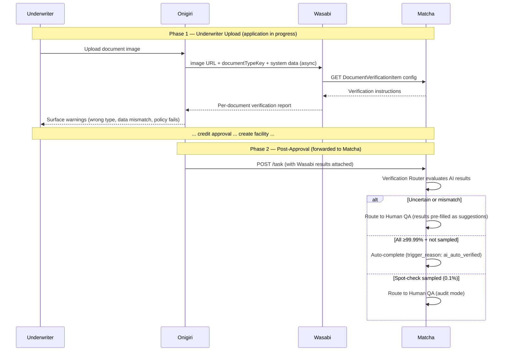

# Product: AI Document Verification Service

**Codename**: Wasabi (わさび)
**Portfolio**: Operations → [PORTFOLIO](../../PORTFOLIO.md)
**Status**: 📝 Draft
**Executive Owner**: COO / Head of AI/ML Platform
**Last Updated**: 2026-03-04

> *Wasabi (わさび) — Sharp clarity. Like wasabi cutting through flavour to reveal what's really there, Wasabi cuts through document images to surface errors before they become problems.*

---

## Problem Statement

Document errors — wrong document type, data mismatches, policy instruction failures — are currently discovered only during QA review in Matcha, after the underwriter has already submitted the application and it has cleared credit approval. Catching errors this late wastes QA time, triggers application returns to Draft, and extends origination cycle times. The underwriter who uploaded the document is no longer in context and must be recalled.

---

## Value Proposition

A stateless LLM vision service that processes document images against Matcha-owned verification instructions and returns a structured per-document verification report to Onigiri **while the underwriter is still working on the application** — enabling immediate correction before formal submission. The same results are forwarded to Matcha post-approval to enable AI-assisted routing (auto-complete for confident results; human QA for uncertain ones).

**For whom**: Underwriters who upload documents during loan origination (Phase 1: early warnings); Matcha Verification Router that uses AI results for routing decisions (Phase 2: routing); AI/ML team that owns and operates the LLM service.

---

## Product Boundary

**This product IS responsible for:**
- Document quality assessment (blur, lighting, truncation, obstruction) before any extraction
- Document type classification (expected vs. detected; type mismatch → flag immediately)
- Instruction-based verification: data item extraction + comparison against system values; policy item evaluation via natural-language check_description
- Per-document report assembly (quality score, type match, per-item results with confidence and reasoning, summary, human-review flag)
- Fetching verification instructions from Matcha config API per documentTypeKey
- Returning structured reports to Onigiri (not to Matcha directly)
- Idempotent re-processing when documents or data change

**This product IS NOT responsible for:**
- Matcha task lifecycle, QA workflow, or routing decisions (owned by **Matcha**)
- Storing verification results after Phase 2 task creation (owned by **Matcha**)
- Storing results during the underwriter phase (owned by **Onigiri**)
- Surfacing warnings to the underwriter UI (owned by **Onigiri**)
- Forwarding results to Matcha on task creation (owned by **Onigiri Worker**)
- Final verification decisions (Matcha auto-completes; human verifier decides on uncertain tasks)
- Loan workflow state management (owned by **Onigiri**)

**This product RECEIVES from:**
- Onigiri → document image URL + expected `documentTypeKey` + system `data` JSON → via async API call (per document)

**This product SENDS to:**
- Matcha → fetch `DocumentVerificationItem` config per `documentTypeKey` → via REST API (Wasabi pulls)
- Onigiri → structured per-document verification report → via async response

---

## Capability Registry

| Capability | Owner | Status | Description |
|-----------|-------|--------|-------------|
| [Document Quality Assessment](capabilities/document-quality-assessment/CAPABILITY.md) | Engineering | Draft | Pre-extraction image quality gate. Evaluates blur, lighting, truncation, obstruction, watermarks. Quality score 0–100. Unusable images skip remaining stages and return requires_human_review. |
| [Document Type Classification](capabilities/document-type-classification/CAPABILITY.md) | Engineering | Draft | LLM identifies document type from image. Compares to expected documentTypeKey. Mismatch or confidence < 99.99% → flag for downstream human review + suggest correct type. |
| [Instruction Verification](capabilities/instruction-verification/CAPABILITY.md) | Engineering | Draft | Data items: LLM extracts field values from image, compares against system data. Policy items: LLM evaluates check_description as natural-language instruction. Per-item result: match / mismatch / low_confidence / not_extractable / instruction_completed / instruction_failed / instruction_uncertain. |
| [Report Assembly](capabilities/report-assembly/CAPABILITY.md) | Engineering | Draft | Aggregates all stage results into a single per-document verification report. Contains quality assessment, type classification, per-item results with confidence and reasoning, summary counts, overall human_review_required flag. |

---

## Two-Phase Value Delivery

---

## The Three Core Questions

Wasabi answers exactly three questions per document:

1. **Is the document type correct?** If not — suggest the correct type.
2. **Is any data incorrect?** If so — highlight the mismatched fields with extracted vs. system values.
3. **Are any instructions not completed?** If so — highlight the failing policy items with reasoning.

---

## Architectural Properties

| Property | Value |
|----------|-------|
| Stateless | Processes request, returns result, stores nothing |
| Independent Deployment | Separate repo, deployment pipeline, scaling |
| Horizontally Scalable | Per-document processing, scales linearly with volume |
| Model-Agnostic | LLM provider swappable via config |
| Idempotent | Same requestId returns cached result |
| Fail-Safe | LLM failures → requires_human_review (Matcha defaults to human QA) |
| Re-Processable | Re-upload triggers re-processing; latest results are authoritative |

---

## Product-Level Metrics and KPIs

| Metric | Description | Target |
|--------|-------------|--------|
| Document Error Catch Rate (Phase 1) | % of document type mismatches caught by Wasabi before Matcha task creation | > 95% |
| Processing Latency | Time from Onigiri request to Wasabi response (p95, per document) | < 10 seconds |
| Auto-Verification Contribution | % of Matcha tasks where Wasabi results contribute to auto-complete path | > 70% (12-month target) |
| Re-processing Rate | % of uploaded documents that require re-processing due to underwriter correction | < 20% |

---

## Open Questions

> These are implementation-level decisions, not product blockers.

1. **Message Queue**: SQS (consistent with Hephaestus flow) or RabbitMQ (consistent with Onigiri Worker)?
2. **Config Caching TTL**: How long should Wasabi cache verification items fetched from Matcha?
3. **Multi-Page Documents**: Multiple `fileUrls` per document — one LLM call with all pages or separate calls per page?
4. **Confidence Calibration**: Single LLM call or consensus voting (multiple calls + compare) for higher confidence?
5. **Re-Processing Trigger**: Should Wasabi automatically re-process when the underwriter updates application *data* (not just re-uploads a document)?

---

## Detailed Reference

For full product specification and design decisions, see: [ATLAS.md](ATLAS.md)
