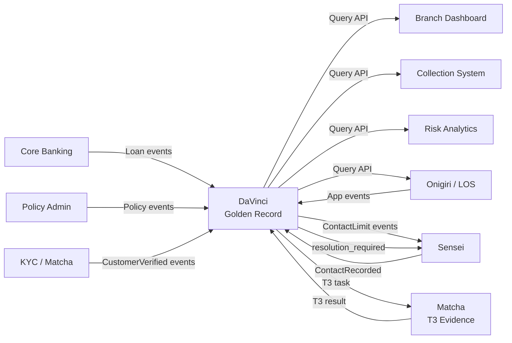

# Product: Customer & Product Master Data

**Codename**: DaVinci (ダヴィンチ)
**Portfolio**: Platform → [PORTFOLIO](../../PORTFOLIO.md)
**Status**: 📝 Draft
**Executive Owner**: CTO / Head of Data Platform
**Last Updated**: 2026-03-04

> *DaVinci (ダヴィンチ) — The Renaissance polymath who unified art, science, and engineering. DaVinci unifies all customer data domains into a single, authoritative, consent-gated Golden Record that every system can trust.*

---

## Problem Statement

The company operates multiple business lines (Lending, Insurance) through shared branch networks. The same branch employee may originate loans, sell insurance, and perform collections — all for the same customer. Without a centralized customer record:
- Thai Debt Collection Act contact frequency limits cannot be enforced — separate teams may unknowingly exceed daily contact limits by contacting the same customer for different products.
- PDPA cross-entity consent rules cannot be enforced — a customer's data from Subsidiary A may be visible to Subsidiary H without explicit consent.
- Address changes, phone number updates, and KYC re-verifications must be repeated across every system independently.
- Cross-sell and upsell opportunities are invisible when customer data is siloed by product.

---

## Value Proposition

The enterprise Golden Record — a single, deduplicated, consent-gated customer profile that aggregates identity from all source systems. Downstream consumers (branch dashboards, collection systems, risk analytics) query DaVinci instead of querying multiple source systems. DaVinci is the single point of query for all customer identity and product summary data.

**For whom**: All downstream systems needing customer data (Onigiri, Sensei, collection systems, dashboards); Compliance teams enforcing PDPA and Debt Collection Act rules; Data stewards managing data quality and resolving conflicts; DaVinci administrators managing the consolidation engine.

---

## Product Boundary

**This product IS responsible for:**
- Golden Record: deduplicated customer profile, `davinci_customer_id`, multi-subsidiary awareness, product summary linkage (loan and insurance summaries — not full records)
- PDPA Consent Registry: directed consent model (A→B ≠ B→A), API-level visibility filtering by subsidiary, consent audit trail
- Event-driven synchronization from Core Banking, Policy Admin, KYC/Matcha, Onigiri
- Downstream Query API for customer profile and product summary lookup
- Customer Data Change Management: Change Request workflow (not direct edits), approval routing by risk level, duplicate detection, change propagation events
- Collection Contact Compliance: unified contact log, frequency check API, block signal, cross-product coordination
- Data Consolidation Engine: field-level authority matrix, 7 deterministic resolution rules, Raw Event Store (append-only), FieldHistory, AlternativeValue, immutable Consolidation Log, admin override with mandatory logging, self-check mechanism
- Data Resolution Workflow: ResolutionRequest lifecycle (T1/T2/T3), 3-tier classification, SLA tracking, integration with Sensei (task executor) and Matcha (T3 evidence verification)

**This product IS NOT responsible for:**
- Full loan agreement or insurance policy storage (owned by **Core Banking** and **Policy Admin** respectively)
- Branch task execution for resolution requests — DaVinci owns the ResolutionRequest state; **Sensei** executes the tasks
- Document verification for T3 identity evidence — **Matcha** owns the verification; DaVinci owns the outcome
- Loan origination workflow (owned by **Onigiri**)

**KNOWN GAPS** (identified in architecture gap analysis):
- Collateral Master Data capability not yet defined in ATLAS — Onigiri captures collateral; cross-product visibility requires a DaVinci home
- `davinci_customer_id` vs. National ID as primary lookup key — unresolved in ARCHITECTURE.md
- REST Query API contract not yet specified in ARCHITECTURE.md

**This product RECEIVES from:**
- Core Banking → LoanDisbursed, LoanPaymentReceived, LoanStatusChanged, LoanClosed events → via event
- Policy Admin → PolicyIssued, PremiumPaid, PolicyLapsed, PolicyCancelled, PolicyRenewed events → via event
- Matcha/KYC → CustomerVerified, CustomerKYCExpired events → via event
- Onigiri → ApplicationCreated, ApplicationApproved, CustomerProfileUpdated events → via event
- Sensei → ContactRecorded events (every customer contact made by CO) → via event
- Matcha → T3 verification result for identity evidence → via webhook callback

**This product SENDS to:**
- Sensei → ContactLimitReached, ContactLimitApproaching, ContactWindowClosed events → via event
- Sensei → customer.resolution_required events (triggers Admin task creation) → via event
- Matcha → T3 verification task request (identity evidence) → via POST /task API
- Onigiri, Sensei, Branch Dashboards, Collection Systems, Risk Analytics → customer profile and product summary → via REST Query API

---

## Capability Registry

| Capability | Owner | Status | Description |
|-----------|-------|--------|-------------|
| [Golden Record](capabilities/golden-record/CAPABILITY.md) | Engineering | Draft | Single deduplicated customer profile. `davinci_customer_id` as canonical key. Identity core (name, DOB, National ID, contacts, addresses). KYC/AML status. Product summary linkage (loans, policies). Multi-subsidiary awareness. |
| [Consent-Based Data Visibility](capabilities/consent-based-visibility/CAPABILITY.md) | Engineering | Draft | PDPA consent registry. Directed consent model (A→B ≠ B→A). Default restricted visibility. API-level consent filtering. Revocation with immediate effect. Consent audit trail. |
| [Event-Driven Synchronization](capabilities/event-driven-synchronization/CAPABILITY.md) | Engineering | Draft | Idempotent event consumption from Core Banking, Policy Admin, KYC/Matcha, Onigiri. Event schema registry with validation. Downstream Query API for customer profile and product summary lookups. |
| [Customer Data Change Management](capabilities/customer-data-change-management/CAPABILITY.md) | Product | Draft | Change Request workflow (not direct edits). Change types: UPDATE_CONTACT, UPDATE_ADDRESS, UPDATE_IDENTITY, MERGE_DUPLICATES. Approval routing: auto-approve low-risk, reviewer-approve high-risk. Duplicate detection on creation/change. CustomerProfileChanged event propagation. |
| [Collection Contact Compliance](capabilities/collection-contact-compliance/CAPABILITY.md) | Engineering | Draft | Unified contact log across all products and subsidiaries. Frequency Check API (how many contacts today for this customer?). Block signal when daily limit reached. Cross-product contact coordination. |
| [Data Consolidation Engine](capabilities/data-consolidation-engine/CAPABILITY.md) | Engineering | Draft | Field-level authority matrix (per-field ranked source list + authority lock). 7 deterministic resolution rules. No-data-loss: Raw Event Store (append-only) + FieldHistory + AlternativeValue. Immutable Consolidation Log per decision. Admin override with mandatory logging. Self-check: post-write + nightly batch. Admin page for management. |
| [Data Resolution Workflow](capabilities/data-resolution-workflow/CAPABILITY.md) | Product | Draft | ResolutionRequest entity (DaVinci-owned lifecycle). 3-tier classification: T1 CO Handle (same day), T2 Needs Approval (3 days), T3 Needs Verification via Matcha (5 days). Entry channels: system conflict, customer call/walk-in, data quality alert. Sensei executes tasks; DaVinci owns state. |

---

## Data Flow Architecture

---

## Consolidation Resolution Rules Summary

| Scenario | Rule | Outcome |
|----------|------|---------|
| New field, no existing value | Accept | Write value. Log: INITIAL_SET |
| Same value, different source | Confirm | Keep value, update last_confirmed_at. Log: CONFIRMED |
| Different value, higher-authority source | Override | Replace value. Archive previous. Log: AUTHORITY_OVERRIDE |
| Different value, lower-authority source | Store alternative | Keep current. Store incoming as AlternativeValue. Log: LOWER_AUTHORITY_STORED |
| Different value, same authority rank | Escalate | Flag for resolution (Capability 7). Log: CONFLICT_ESCALATED |
| Authority-locked field, below Rank 1 | Reject override | Keep current. Log: AUTHORITY_LOCKED_REJECTED |
| Out-of-order event | Evaluate + flag | Apply rules. Log: OUT_OF_ORDER_PROCESSED. Self-check triggers. |

---

## Product-Level Metrics and KPIs

| Metric | Description | Target |
|--------|-------------|--------|
| Golden Record Coverage | % of active customers with a DaVinci record | 100% |
| Event Processing Latency | Time from upstream event to DaVinci Golden Record update (p95) | < 30 seconds |
| PDPA Consent Enforcement | % of cross-entity data access attempts correctly blocked without valid consent | 100% |
| T1 Resolution SLA | % of T1 ResolutionRequests resolved on same day | > 95% |
| T3 Resolution SLA | % of T3 ResolutionRequests resolved within 5 business days | > 90% |
| Contact Frequency Violations | % of collection contacts that exceed Thai Debt Collection Act daily limit | 0% |
| Data Quality Score | % of Golden Records passing nightly self-check batch validation | > 99.9% |

---

## Detailed Reference

For full capability specifications and design decisions, see: [ATLAS.md](ATLAS.md)
For technical architecture and data models, see: [Architecture.md](Architecture.md)
For known architecture gaps, see: [artifacts/research/atlas_vs_architecture_gap_analysis.md](artifacts/research/atlas_vs_architecture_gap_analysis.md)
