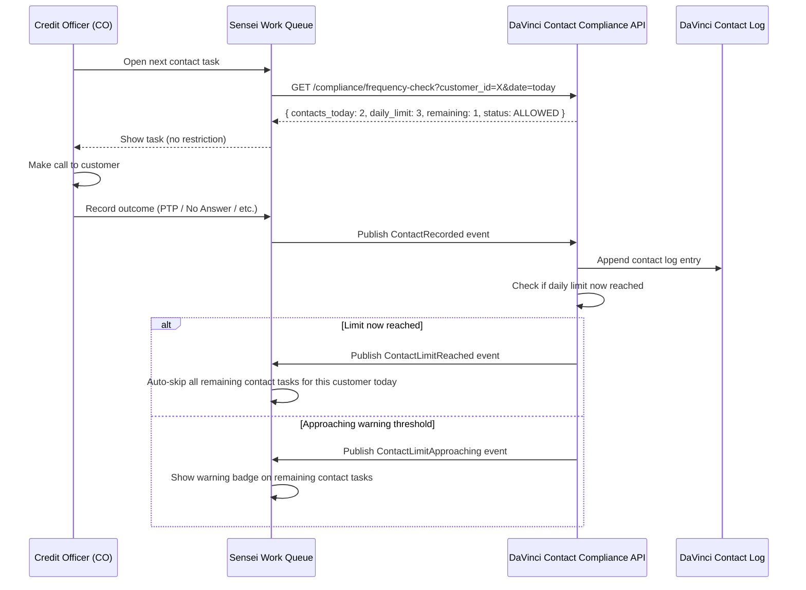
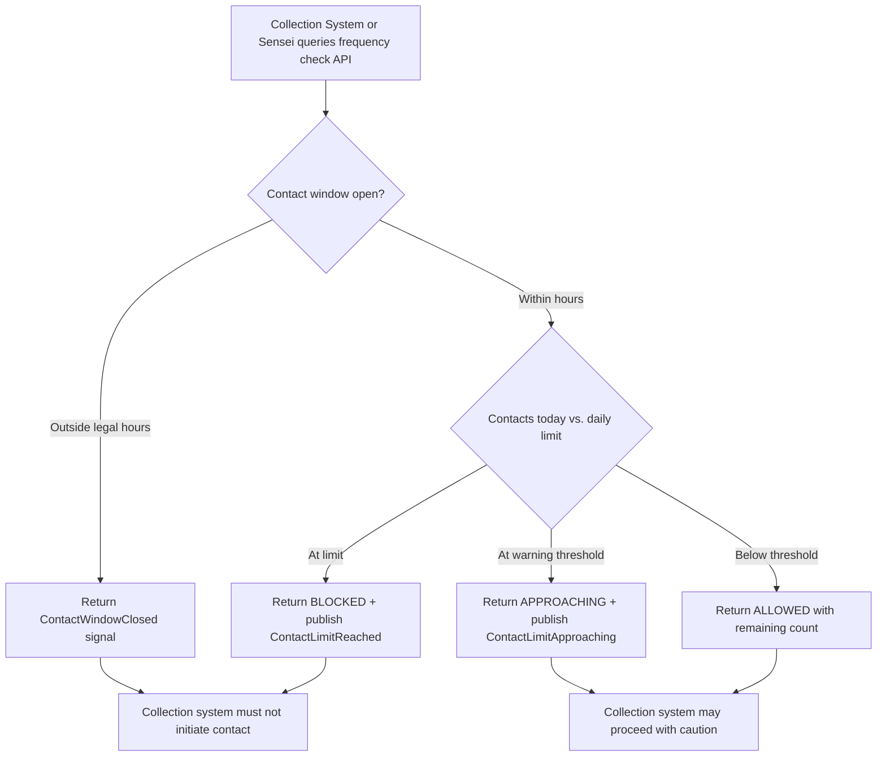

# Capability: Collection Contact Compliance

**Product**: DaVinci — [PRODUCT](../../PRODUCT.md)
**Portfolio**: Platform
**Product Owner**: TBD (Platform PO)
**Status**: 📝 Draft — @FEATURE decomposition pending
**Last Updated**: 2026-03-04

---

## Business Function

Enable collection teams to comply with Thai Debt Collection Act contact frequency limits by providing a unified log of all customer contacts across every product and subsidiary, and a real-time frequency check API that any collection system can query before initiating contact.

## Why It Exists (First Principles)

Thai Debt Collection regulations limit how many times a debtor can be contacted per day. The company operates multiple products (loans, insurance) across multiple subsidiaries — each with separate collection systems. Without a shared contact log:
- Subsidiary H's collection team may contact a customer 3 times for delinquent loans
- Subsidiary A's collection team may contact the same customer 3 times for a lapsed insurance policy
- No single system knows the total contact count — making compliance impossible

DaVinci is the only entity that has a unified view of all products and all subsidiaries for a single customer. This makes DaVinci the natural owner of the contact log and the compliance enforcement API.

> ⚠️ **Boundary Note**: Sensei's `contact-compliance` capability **subscribes** to DaVinci's compliance events and enforces restrictions in the branch worklist UI. It does **NOT** own the contact log or the frequency limit rules — those are exclusively owned here in DaVinci.

---

## Feature Inventory

| Feature | Status | Description |
|---------|--------|-------------|
| Unified Contact Log | Draft | All collection contacts (call, SMS, visit) across all products and subsidiaries logged in DaVinci; each entry keyed to davinci_customer_id |
| Frequency Check API | Draft | Pre-contact API: given customer_id + today's date, returns total contacts made today and remaining allowance |
| Block Signal | Draft | When daily limit is reached, DaVinci returns a block status and publishes ContactLimitReached event |
| Contact Window Enforcement | Draft | DaVinci tracks permissible contact hours; publishes ContactWindowClosed event when outside legal hours |
| Approaching Limit Warning | Draft | When contacts reach a configurable warning threshold, DaVinci publishes ContactLimitApproaching event |
| Cross-Product Coordination | Draft | DaVinci surfaces all active delinquent products for a customer so collection teams can coordinate a single contact strategy |
| Contact Log API (write) | Draft | Receives ContactRecorded events from Sensei after each contact task completion |

---

## Business Rules

### Contact Frequency Rules

| Rule | Behavior |
|------|----------|
| Contact count reaches Thai Debt Collection Act daily limit | Publish ContactLimitReached event; return BLOCKED on frequency check API |
| Contact count reaches warning threshold (configurable, default: limit − 1) | Publish ContactLimitApproaching event |
| Contact attempted outside legal hours | Return ContactWindowClosed signal; refuse to increment contact count |
| Contact count query for today | Return { contacts_today, daily_limit, remaining, status: ALLOWED / APPROACHING / BLOCKED } |
| Frequency limit reset time | Daily at midnight (Thailand timezone, UTC+7) |

### Contact Log Entry Fields

| Field | Description |
|-------|-------------|
| `contact_log_id` | System-generated unique identifier |
| `customer_id` | DaVinci customer ID |
| `contacted_at` | ISO timestamp of contact (from Sensei's ContactRecorded event) |
| `contact_channel` | call / sms / visit |
| `contact_outcome` | PTP / no_answer / refused / completed / etc. |
| `product_ref` | Loan account or policy number that prompted the contact |
| `subsidiary_id` | Subsidiary initiating the contact |
| `contact_officer_id` | CO user ID |
| `source_task_id` | Sensei task ID (for cross-reference) |

### Published Events

| Event | Trigger | Consumers |
|-------|---------|-----------|
| `ContactLimitReached` | Daily contact count hits legal limit | Sensei (auto-skips remaining contact tasks for this customer today) |
| `ContactLimitApproaching` | Count hits warning threshold | Sensei (shows warning badge on contact tasks) |
| `ContactWindowClosed` | Current time is outside legal contact hours | Sensei (blocks contact tasks outside window) |

---

## User Flow

---

## NFRs

| NFR | Requirement |
|-----|-------------|
| Real-time revocation enforcement | ContactLimitReached event must be published within 5 seconds of the limit-reaching contact being recorded |
| Contact log immutability | Contact log entries are append-only; no entry may be modified or deleted |
| Frequency check API latency | p95 < 100ms (called synchronously before every contact task) |
| Daily reset consistency | Limit counter resets at midnight Thailand timezone (UTC+7); no contact from the previous day carries over |
| Audit completeness | 100% of ContactRecorded events from Sensei result in a persisted contact log entry |
| Cross-subsidiary aggregation | Frequency count includes contacts from ALL subsidiaries, not just the requesting subsidiary |

---

## Open Questions

- What is the exact Thai Debt Collection Act daily contact limit? (This must be codified as a configurable constant, not hard-coded.)
- Are contact window hours fixed by regulation, or can they be configured per branch / region?
- Does an SMS count as the same "contact" as a phone call for frequency limit purposes?
- What is the enforcement model if Sensei fails to publish ContactRecorded? Does DaVinci have a compensating mechanism?
