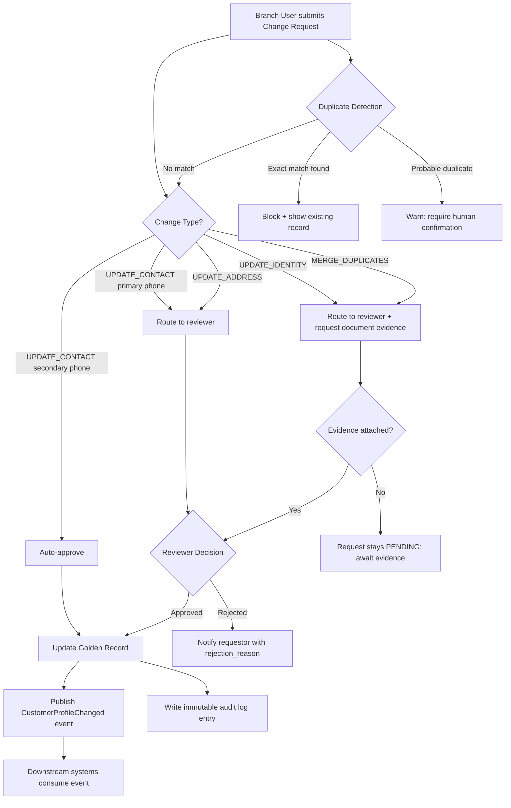

# Capability: Customer Data Change Management

**Product**: DaVinci — [PRODUCT](../../PRODUCT.md)
**Portfolio**: Platform
**Product Owner**: TBD (Platform PO)
**Status**: 📝 Draft — @FEATURE decomposition pending
**Last Updated**: 2026-03-04

---

## Business Function

Provide a governed workflow for creating, updating, and merging customer records — ensuring data quality, audit compliance, and controlled change propagation across all downstream systems.

## Why It Exists (First Principles)

Customer data changes (address updates, phone number corrections, name changes after marriage) have downstream impact across all products simultaneously. An uncontrolled direct edit could:
- Break collection correspondence (wrong address in all connected systems)
- Create compliance gaps (KYC records becoming inconsistent with identity documents)
- Generate duplicate records when a new customer is mistakenly created instead of matched

A Change Request workflow — rather than direct edit access — creates an audit trail, enables approval gating for high-risk fields, and ensures propagation events reach all downstream consumers.

---

## Feature Inventory

| Feature | Status | Description |
|---------|--------|-------------|
| Change Request Submission | Draft | Branch users submit Change Requests (not direct edits); captured with before/after, supporting_document_ref, and change_type |
| Change Type Classification | Draft | Four types: UPDATE_CONTACT, UPDATE_ADDRESS, UPDATE_IDENTITY, MERGE_DUPLICATES |
| Approval Routing Engine | Draft | Auto-approve low-risk; reviewer-approve high-risk; merge always requires approval + evidence |
| Duplicate Detection | Draft | On new customer creation or change request, runs name + DOB + ID fuzzy match to flag potential duplicates |
| Change Propagation | Draft | On approval, updates Golden Record + publishes CustomerProfileChanged event + immutable audit log entry |
| Change Request Audit Trail | Draft | Immutable record per request: requested_by, requested_at, change_type, field_changes, approval decision |

---

## Business Rules

### Change Type Definitions

| Change Type | Description | Risk Level | Default Approval |
|-------------|-------------|------------|-----------------|
| `UPDATE_CONTACT` | Update phone numbers or email address | Low | Auto-approved |
| `UPDATE_ADDRESS` | Update home, work, or mailing address | High | Requires reviewer approval |
| `UPDATE_IDENTITY` | Correct name, National ID, DOB, passport | High | Requires reviewer approval + documentary evidence |
| `MERGE_DUPLICATES` | Merge two customer records into one canonical record | Critical | Always requires approval + supporting evidence |

### Approval Routing Rules

| Condition | Routing |
|-----------|---------|
| UPDATE_CONTACT (secondary phone) | Auto-approved |
| UPDATE_CONTACT (primary phone) | Reviewer approval |
| UPDATE_ADDRESS (any type) | Reviewer approval |
| UPDATE_IDENTITY (any field) | Reviewer approval + documentary evidence |
| MERGE_DUPLICATES | Always manual approval + evidence; cannot be auto-approved |
| Change Request with supporting_document_ref attached | Routed to reviewer regardless of risk level |
| Change Request flagged as duplicate by detection | Requires duplicate resolution decision before approval |

### Change Request Fields

| Field | Description |
|-------|-------------|
| `request_id` | System-generated unique identifier |
| `customer_id` | DaVinci customer ID being modified |
| `requested_by` | User ID of branch staff or system submitting the request |
| `requested_at` | ISO timestamp of submission |
| `change_type` | UPDATE_CONTACT / UPDATE_ADDRESS / UPDATE_IDENTITY / MERGE_DUPLICATES |
| `field_changes` | Array of { field_name, before_value, after_value } |
| `supporting_document_ref` | Reference to uploaded evidence document (optional for low-risk) |
| `status` | PENDING / APPROVED / REJECTED / CANCELLED |
| `reviewed_by` | User ID of reviewer (null if auto-approved) |
| `reviewed_at` | ISO timestamp of decision |
| `rejection_reason` | Mandatory if status = REJECTED |

### Duplicate Detection Rules

| Match Condition | Action |
|----------------|--------|
| Name (exact) + DOB (exact) + National ID (exact) | Block creation; show existing record |
| Name (fuzzy ≥ 85%) + DOB (exact) | Flag as probable duplicate; require human confirmation |
| National ID (exact) only | Block creation; treat as same customer regardless of name difference |
| Phone number (exact) on active record | Warn; do not block (same phone can appear on related accounts) |

---

## User Flow

---

## NFRs

| NFR | Requirement |
|-----|-------------|
| Audit completeness | Every Change Request and every approval decision logged immutably; no exceptions |
| Propagation latency | CustomerProfileChanged event published within 5 seconds of approval |
| Duplicate detection coverage | 100% of new customer creation attempts and UPDATE_IDENTITY requests run through duplicate detection |
| Auto-approval latency | Low-risk auto-approved requests applied to Golden Record within 10 seconds of submission |
| No direct edits | There is no path to modify the Golden Record outside of the Change Request workflow or the Consolidation Engine admin override (Capability 6). Zero exceptions. |

---

## Open Questions

- Who are the designated reviewers for high-risk change requests? Is this a role-based assignment or branch-based?
- Should UPDATE_CONTACT for a primary phone number be auto-approved or reviewer-approved? Currently: reviewer-approved.
- What is the escalation path if a reviewer does not act within the SLA for high-risk requests?
- For MERGE_DUPLICATES, which record becomes canonical and which is archived? Is this configurable or always the older record?
