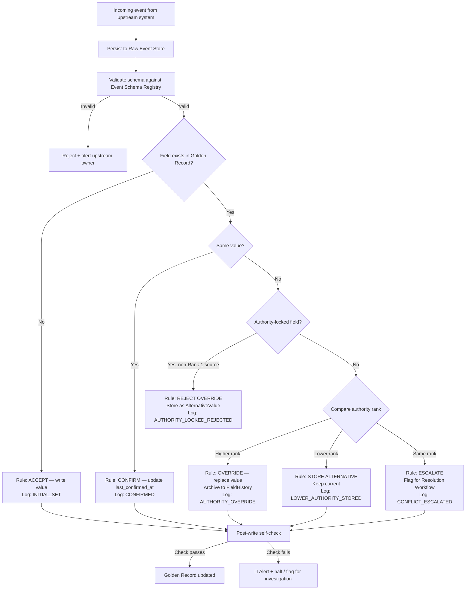

# Capability: Data Consolidation Engine

**Product**: DaVinci — [PRODUCT](../../PRODUCT.md)
**Portfolio**: Platform
**Product Owner**: TBD (Platform PO)
**Status**: 📝 Draft — @FEATURE decomposition pending
**Last Updated**: 2026-03-04

---

## Business Function

Deterministically assemble a single Golden Record from data arriving from multiple upstream sources — with field-level authority ranking, no-data-loss guarantees, self-check integrity validation, and a fully logged admin override function.

## Why It Exists (First Principles)

DaVinci receives customer data from multiple systems (Core Banking, Policy Admin, KYC/Matcha, Onigiri, CRM). These sources are each authoritative for *different fields* of the same customer. Without explicit consolidation logic:
- **Last-write-wins** → silently loses data from trusted sources
- **Reject conflicts** → creates an ever-growing unresolved backlog
- **Keep everything** → no one trusts the Golden Record

Authority is **field-level**, not source-level. CRM knows phone numbers best; Core Banking knows balances best. Recency alone is insufficient — a CRM address from 2024 may be the correct *home* address while a LOS address from 2026 is the *work* address. The Consolidation Engine codifies these distinctions as configuration, not code.

> **Delivery Note**: This capability is self-contained and can be delivered *before* the Data Resolution Workflow (Capability 7). The Consolidation Engine provides the `CONFLICT_ESCALATED` flag as its output; the Resolution Workflow processes that flag.

---

## Feature Inventory

| Feature | Status | Description |
|---------|--------|-------------|
| Field Authority Matrix | Draft | Per-field ranked list of authoritative sources; authority-lock flag for critical fields; conflict tier assignment (T1/T2/T3) |
| Resolution Rules Engine | Draft | 7 deterministic rules applied per field per incoming event; no manual decision required for 5 of 7 rules |
| Raw Event Store | Draft | Append-only verbatim storage of every incoming event before processing; never deleted |
| FieldHistory | Draft | Previous Golden Record field values moved to history on update; never deleted |
| AlternativeValue | Draft | Lower-authority or conflicting values stored alongside the primary value; can be promoted |
| Consolidation Log | Draft | Immutable audit entry per consolidation decision: field, rule_applied, previous/incoming/resolved values, authority rank |
| Admin Override | Draft | Force-set any Golden Record field with mandatory logged reason; alternative promotion; reversible |
| Self-Check Mechanism | Draft | Post-write hash verification + log-record consistency checks; nightly batch reconciliation; Data Quality Report |
| Admin Page | Draft | UI for managing field authority matrix, override panel, audit log viewer, source registry |

---

## Business Rules

### Resolution Rules (7 Deterministic Rules)

| Scenario | Rule | Outcome | Log Entry |
|----------|------|---------|-----------|
| New field, no existing value | **Accept** | Write the value | `INITIAL_SET` |
| Same value from different source | **Confirm** | Keep value; update `last_confirmed_at` | `CONFIRMED` |
| Different value, higher-authority source | **Override** | Replace value; archive previous to FieldHistory | `AUTHORITY_OVERRIDE` |
| Different value, lower-authority source | **Store alternative** | Keep current value; store incoming as AlternativeValue | `LOWER_AUTHORITY_STORED` |
| Different value, same authority rank | **Escalate** | Flag for Resolution Workflow (Capability 7) | `CONFLICT_ESCALATED` |
| Authority-locked field (🔒), non-Rank-1 source | **Reject override** | Keep current; store incoming as AlternativeValue | `AUTHORITY_LOCKED_REJECTED` |
| Out-of-order event (event timestamp < current value timestamp) | **Evaluate + flag** | Apply above rules, then log as out-of-order; trigger self-check | `OUT_OF_ORDER_PROCESSED` |

### Field Authority Matrix Rules

| Concept | Rule |
|---------|------|
| Authority Ranking | Per-field ordered list: Rank 1 wins over Rank 2 wins over Rank 3, etc. |
| Authority Lock (🔒) | Fields: National ID, DOB, KYC Status, Loan Balance. Only Rank 1 source can write. All others stored as AlternativeValue. |
| Conflict Tier | Each field assigned T1 / T2 / T3. Controls routing when `CONFLICT_ESCALATED`. Default for new fields: T2. |
| Tier T1 | CO can resolve during next customer contact (same day SLA) |
| Tier T2 | Requires supervisor/data-steward approval (3 business days SLA) |
| Tier T3 | Requires documentary evidence + Matcha verification (5 business days SLA) |

### Self-Check Rules

| Check | Validates | On Failure |
|-------|-----------|------------|
| Hash verification | SHA-256 of resolved values matches what was written to DB | 🔴 Halt + alert — data integrity breach |
| Log-record consistency | Golden Record field value matches latest `resolved_value` in Consolidation Log | 🔴 Flag for immediate investigation |
| Field completeness | Required fields (name, national_id, DOB) are not null | 🟡 Warning + log |
| Temporal consistency | `last_updated_at` ≥ previous value's timestamp | 🟡 Warning (possible out-of-order) |

**Nightly Batch Checks:**
- **Log reconciliation**: Replay consolidation logs for 1% sampled customers; verify result matches current Golden Record
- **Raw Event completeness**: Every event in Raw Event Store has a corresponding Consolidation Log entry
- **Alternative value staleness**: Alternatives with `pending_review` status older than 90 days flagged
- **Cross-field consistency**: Business rules (e.g., `KYC_status = VERIFIED` → `kyc_verified_date` must not be null)
- Results published as a **Data Quality Report**

### Admin Override Rules

| Rule | Behavior |
|------|----------|
| Who can override | DaVinci administrators and designated data stewards only |
| Logging requirement | Every override creates a Consolidation Log entry (resolution_type = `ADMIN_OVERRIDE`). Mandatory fields: `overridden_by`, `override_reason` (free-text, non-empty), `previous_value`, `new_value`, `timestamp` |
| Alternative promotion | Admin can promote a stored AlternativeValue to the Golden Record. Logged as `ADMIN_PROMOTED` |
| Reversibility | Admin overrides can be reversed by a subsequent override. Full history preserved in Consolidation Log |
| No silent changes | There is **no** path to modify the Golden Record without a Consolidation Log entry. Zero exceptions. |

### Consolidation Log Entry Fields

| Field | Description |
|-------|-------------|
| `log_id` | System-generated unique identifier |
| `customer_id` | DaVinci customer ID |
| `event_id` | Source event that triggered this decision (null for admin override) |
| `field_name` | Golden Record field being resolved |
| `source_system` | Origin of the incoming value |
| `resolution_type` | INITIAL_SET / CONFIRMED / AUTHORITY_OVERRIDE / LOWER_AUTHORITY_STORED / CONFLICT_ESCALATED / AUTHORITY_LOCKED_REJECTED / OUT_OF_ORDER_PROCESSED / ADMIN_OVERRIDE / ADMIN_PROMOTED |
| `previous_value` | Value before resolution (null for INITIAL_SET) |
| `incoming_value` | Value from the incoming event |
| `resolved_value` | Final value written to Golden Record |
| `authority_rank` | Rank of source_system for this field |
| `rule_applied` | Human-readable rule name |
| `created_at` | Immutable timestamp |

---

## User Flow

---

## NFRs

| NFR | Requirement |
|-----|-------------|
| No data loss | Every incoming event persisted to Raw Event Store before processing; no event ever silently dropped |
| Audit completeness | Every consolidation decision produces an immutable Consolidation Log entry; 100% coverage |
| Determinism | Same input always produces same output; no probabilistic rules; no random tiebreakers |
| Self-check coverage | Post-write hash verification on 100% of writes; nightly batch on 1% sampled records |
| Admin override logging | No override is possible without a Consolidation Log entry — enforced at API layer, not convention |
| Processing latency | Event → Golden Record update (p95) < 30 seconds (shared target with Event-Driven Synchronization) |

---

## Open Questions

- What is the initial Field Authority Matrix configuration? Which source systems are Rank 1 for which fields?
- Who are the designated data stewards with admin override authority?
- What is the Data Quality Report distribution list and format?
- How are out-of-order events detected — by event timestamp vs. field `last_updated_at`, or by explicit sequence numbers?
- What is the retention policy for the Raw Event Store? Currently: indefinite (never deleted). Is this feasible at scale?
