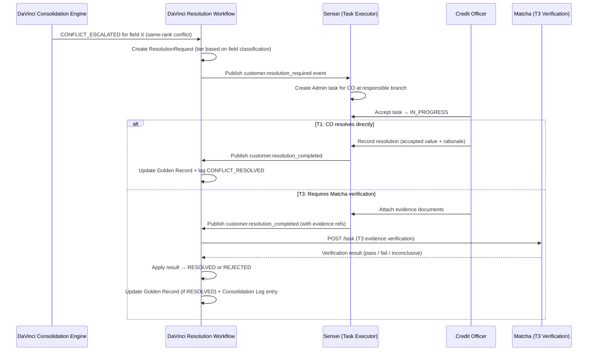

# Capability: Data Resolution Workflow

**Product**: DaVinci — [PRODUCT](../../PRODUCT.md)
**Portfolio**: Platform
**Product Owner**: TBD (Platform PO)
**Status**: 📝 Draft — @FEATURE decomposition pending
**Last Updated**: 2026-03-04

---

## Business Function

Provide a structured, tiered process for resolving data conflicts and processing customer-initiated change requests — where DaVinci owns the ResolutionRequest lifecycle and SLA, Sensei executes the field staff tasks, and Matcha provides documentary evidence verification for identity-critical fields.

## Why It Exists (First Principles)

The Data Consolidation Engine (Capability 6) auto-resolves most conflicts via authority rules. But some conflicts cannot be resolved by authority alone:
- **Same-rank sources disagree** → the system cannot choose without human judgement
- **Customer requests a change** → no upstream event exists; a human must initiate the change
- **Identity-affecting fields** → require documentary evidence, not just assertion from a branch officer

Without a structured workflow, these cases accumulate as unresolved `CONFLICT_ESCALATED` flags that no one owns. Customer-initiated changes bypass the consolidation audit trail entirely, breaking the no-data-loss guarantee.

> **Dependency**: This capability depends on the Data Consolidation Engine (Capability 6) being in place. The Resolution Workflow extends the `CONFLICT_ESCALATED` path with structured resolution and adds customer-initiated change request support.

> ⚠️ **Critical Boundary**: DaVinci owns the `ResolutionRequest` entity, its lifecycle states, SLA tracking, and the Golden Record update upon resolution. Sensei receives `customer.resolution_required` events and creates/completes field-staff tasks only — **Sensei does not track resolution state.**

---

## Feature Inventory

| Feature | Status | Description |
|---------|--------|-------------|
| ResolutionRequest Entity | Draft | DaVinci-owned entity with lifecycle states, tier classification, SLA tracking, and resolution outcome recording |
| 3-Tier Classification | Draft | T1 (CO Handle — same day), T2 (Needs Approval — 3 days), T3 (Needs Verification via Matcha — 5 days) |
| System Conflict Entry | Draft | Auto-creates ResolutionRequest when Consolidation Engine logs CONFLICT_ESCALATED |
| Customer-Initiated Entry | Draft | Call center and branch staff create ResolutionRequests via DaVinci API for customer change requests |
| Data Quality Alert Entry | Draft | Self-check batch auto-creates ResolutionRequests for detected inconsistencies |
| Sensei Task Integration | Draft | DaVinci publishes customer.resolution_required → Sensei creates Admin task → DaVinci receives customer.resolution_completed |
| Matcha T3 Verification | Draft | DaVinci creates Matcha verification task for T3 evidence; receives pass/fail/inconclusive callback |
| SLA Tracking | Draft | Per-tier SLA enforcement; escalation triggers when deadline exceeded |
| Golden Record Update on Resolution | Draft | Upon resolution, DaVinci applies the accepted value to the Golden Record + logs in Consolidation Log |

---

## Business Rules

### 3-Tier Resolution Classification

| Tier | Name | Example Fields | Resolver | SLA |
|------|------|---------------|----------|-----|
| **T1** 🟢 | CO Handle | Phone numbers, email, address | CO at customer's responsible branch | Same business day |
| **T2** 🟡 | Needs Approval | Name, employer, marital status, income | CO submits → Supervisor or Data Steward approves | 3 business days |
| **T3** 🔴 | Needs Verification | National ID, DOB, KYC status, passport number | Evidence submitted → Matcha verifies → DaVinci accepts or rejects | 5 business days |

### ResolutionRequest Lifecycle States

| Tier | State Machine |
|------|--------------|
| **T1** | OPEN → IN_PROGRESS → RESOLVED |
| **T1** | OPEN → IN_PROGRESS → ESCALATED (bumps to T2) |
| **T2** | OPEN → IN_PROGRESS → PENDING_APPROVAL → RESOLVED (approved) |
| **T2** | OPEN → IN_PROGRESS → PENDING_APPROVAL → REJECTED (denied) |
| **T2** | OPEN → IN_PROGRESS → ESCALATED (bumps to T3) |
| **T3** | OPEN → EVIDENCE_REQUIRED → VERIFICATION_IN_PROGRESS → RESOLVED |
| **T3** | OPEN → EVIDENCE_REQUIRED → VERIFICATION_IN_PROGRESS → REJECTED |
| **T3** | OPEN → EVIDENCE_REQUIRED → VERIFICATION_IN_PROGRESS → MANUAL_REVIEW → RESOLVED / REJECTED |

### Entry Channels

| Channel | Actor | Creation Mechanism |
|---------|-------|-------------------|
| System conflict | Consolidation Engine | Auto-creates ResolutionRequest when `CONFLICT_ESCALATED` rule fires |
| Customer phone call | Call center agent | Creates ResolutionRequest via DaVinci API; T3 fields require branch visit with documents |
| Branch walk-in | Branch staff | Creates ResolutionRequest via DaVinci API; can attach evidence immediately |
| Data quality alert | Self-check nightly batch | Auto-creates ResolutionRequest for detected inconsistencies |

### SLA Escalation Rules

| Condition | Action |
|-----------|--------|
| T1 ResolutionRequest not IN_PROGRESS within 4 hours of OPEN | Alert branch supervisor |
| T1 ResolutionRequest not RESOLVED within same business day | Auto-escalate to T2 |
| T2 ResolutionRequest not RESOLVED within 3 business days | Auto-escalate to T3 |
| T3 ResolutionRequest not RESOLVED within 5 business days | Alert Data Steward and compliance team |

### Product Boundary Rules

| System | Role | What It Does NOT Do |
|--------|------|---------------------|
| **DaVinci** | Owns ResolutionRequest entity, lifecycle states, SLA tracking, Golden Record update | Does not create field-staff tasks (Sensei does) |
| **Sensei** | Creates Admin tasks for COs; returns resolution_completed | Does NOT track ResolutionRequest state; does not own resolution outcome |
| **Matcha** | Verifies documentary evidence for T3 requests; returns pass/fail/inconclusive | Does not own the resolution decision; DaVinci decides based on Matcha's result |

---

## User Flow

```mermaid
stateDiagram-v2
    [*] --> OPEN: ResolutionRequest created\n(system conflict / customer request / data quality alert)
    OPEN --> IN_PROGRESS: Sensei task accepted by CO
    IN_PROGRESS --> RESOLVED: CO records resolution outcome\n(T1: direct; T2: with approval; T3: after Matcha verification)
    IN_PROGRESS --> ESCALATED: CO escalates to higher tier
    ESCALATED --> OPEN: Re-opened at higher tier (T1→T2 or T2→T3)
    IN_PROGRESS --> PENDING_APPROVAL: T2 — CO submits for supervisor approval
    PENDING_APPROVAL --> RESOLVED: Supervisor approves
    PENDING_APPROVAL --> REJECTED: Supervisor rejects
    IN_PROGRESS --> EVIDENCE_REQUIRED: T3 — evidence needed from customer
    EVIDENCE_REQUIRED --> VERIFICATION_IN_PROGRESS: Evidence submitted to Matcha
    VERIFICATION_IN_PROGRESS --> RESOLVED: Matcha verifies pass
    VERIFICATION_IN_PROGRESS --> REJECTED: Matcha returns fail
    VERIFICATION_IN_PROGRESS --> MANUAL_REVIEW: Matcha returns inconclusive
    MANUAL_REVIEW --> RESOLVED: Data steward decision: accept
    MANUAL_REVIEW --> REJECTED: Data steward decision: reject
    RESOLVED --> [*]: Golden Record updated + Consolidation Log entry
    REJECTED --> [*]: ResolutionRequest closed; Golden Record unchanged
```

---

## NFRs

| NFR | Requirement |
|-----|-------------|
| SLA visibility | All ResolutionRequests display remaining SLA time in real-time to responsible parties |
| Audit completeness | Every state transition in the ResolutionRequest lifecycle produces an immutable log entry |
| No orphaned requests | Every `CONFLICT_ESCALATED` log entry must result in a ResolutionRequest; no silent discard |
| State ownership | DaVinci is the single source of truth for ResolutionRequest state; Sensei must not maintain a parallel state |
| T1 SLA | > 95% of T1 ResolutionRequests resolved within same business day |
| T3 SLA | > 90% of T3 ResolutionRequests resolved within 5 business days |

---

## Open Questions

- Is there a ResolutionRequest dashboard for data stewards in DaVinci, or is this exposed only via Sensei's admin task view?
- How are T3 ResolutionRequests initiated by customers over the phone routed to branches? Is the responsible branch determined by `originating_subsidiary_id` on the product?
- What happens to the Golden Record during the resolution period? Does the conflicting field remain at its pre-conflict value, or is it marked as `UNRESOLVED`?
- Can a ResolutionRequest be withdrawn by the requestor after creation? If so, what is the lifecycle path (OPEN → CANCELLED)?
