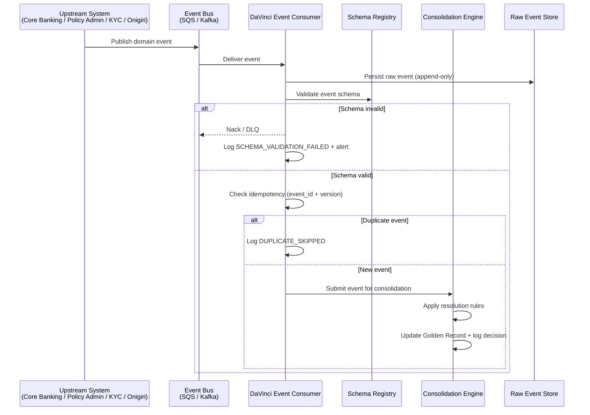
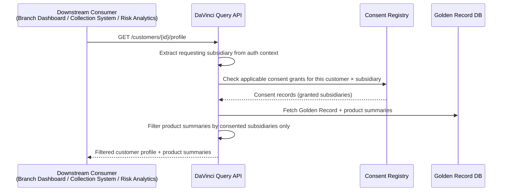

# Capability: Event-Driven Data Synchronization

**Product**: DaVinci — [PRODUCT](../../PRODUCT.md)
**Portfolio**: Platform
**Product Owner**: TBD (Platform PO)
**Status**: 📝 Draft — @FEATURE decomposition pending
**Last Updated**: 2026-03-04

---

## Business Function

Keep DaVinci current with upstream transactional systems by consuming domain events, making DaVinci the **single point of query** for all downstream services that need customer or product summary data.

## Why It Exists (First Principles)

DaVinci is **not** the system of record for loans or insurance policies — Core Banking and Policy Admin own those. However, downstream consumers (branch dashboards, collection systems, risk analytics, reporting) should not query multiple fragmented source systems. DaVinci acts as the **materialized read model**: a centralized, pre-joined, always-current view that every downstream service can trust.

Without event-driven sync:
- Downstream services must query 4+ source systems for a single customer view
- Contact frequency tracking is impossible without a unified view of all products
- Product summaries go stale, causing collection and compliance errors

---

## Feature Inventory

| Feature | Status | Description |
|---------|--------|-------------|
| Core Banking Event Consumer | Draft | Consumes LoanDisbursed, LoanPaymentReceived, LoanStatusChanged, LoanBalanceUpdated, LoanClosed events |
| Policy Admin Event Consumer | Draft | Consumes PolicyIssued, PremiumPaid, PolicyLapsed, PolicyCancelled, PolicyRenewed events |
| KYC / Matcha Event Consumer | Draft | Consumes CustomerVerified, CustomerKYCExpired events |
| Onigiri Event Consumer | Draft | Consumes ApplicationCreated, ApplicationApproved, CustomerProfileUpdated events |
| Event Schema Registry | Draft | Shared schema contract; validates incoming events before processing |
| Idempotency Handler | Draft | Keyed on event_id + version; handles duplicates and out-of-order events gracefully |
| Downstream Query API | Draft | REST API for customer profile lookup, product summary by customer, contact history queries |

---

## Business Rules

### Event Consumption Rules

| Rule | Behavior |
|------|----------|
| Duplicate event (same event_id) | Idempotently ignored; log as DUPLICATE_SKIPPED |
| Out-of-order event (timestamp < current field value) | Apply consolidation rules; log as OUT_OF_ORDER_PROCESSED; trigger self-check |
| Schema validation failure | Reject event; log error; alert upstream owner |
| Unknown event type | Reject; log as UNKNOWN_EVENT; do not silently drop |
| Missing customer_id in event | Attempt ID resolution via National ID / phone; if unresolved, log as UNRESOLVABLE_CUSTOMER |

### Upstream Event Sources

| Source System | Events Consumed | Update Target |
|---------------|----------------|---------------|
| Core Banking | LoanDisbursed, LoanPaymentReceived, LoanStatusChanged, LoanBalanceUpdated, LoanClosed | Loan product summary record |
| Policy Admin | PolicyIssued, PremiumPaid, PolicyLapsed, PolicyCancelled, PolicyRenewed | Insurance product summary record |
| KYC / Matcha | CustomerVerified, CustomerKYCExpired | KYC status on Golden Record |
| Onigiri (LOS) | ApplicationCreated, ApplicationApproved, CustomerProfileUpdated | Customer profile + application status |
| Sensei | ContactRecorded | Unified contact log (for Collection Contact Compliance) |

### Downstream Query API Endpoints

| Query | Filter | Notes |
|-------|--------|-------|
| Customer profile lookup | By davinci_customer_id, phone, name | Results filtered by consent before returning |
| Product summary by customer | All loans + all policies for a customer | Filtered by requesting subsidiary + consent |
| Contact history and frequency | By customer_id + date range | Used by collection compliance check |

---

## User Flow

---

## NFRs

| NFR | Requirement |
|-----|-------------|
| Event processing latency | Time from upstream event publish to Golden Record update (p95) < 30 seconds |
| Idempotency | Duplicate events MUST be silently absorbed with no side effects |
| Schema enforcement | 100% of incoming events validated against registry; no unvalidated writes |
| Downstream query latency | Customer profile API (p95) < 200ms |
| At-least-once delivery | No event may be silently dropped; DLQ required for all failed events |
| Raw Event Store retention | Raw events retained indefinitely (append-only, never deleted) |

---

## Open Questions

- What event bus technology is used? SQS/SNS (consistent with Hephaestus) or Kafka?
- What is the schema registry implementation? AWS Glue Schema Registry, Confluent, or custom?
- How are schema version upgrades handled — forward compatibility only, or full bidirectional?
- What is the DLQ alerting and retry policy for schema validation failures?
