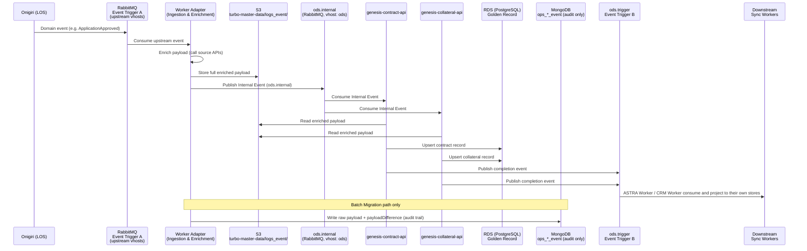

# Product: Contract & Collateral Master Data

**Codename**: Genesis
**Portfolio**: Platform → [PORTFOLIO](../../PORTFOLIO.md)
**Status**: 📝 Draft
**Executive Owner**: CTO / Head of Data Platform
**Last Updated**: 2026-03-06

> *Genesis — the origin point. Like the first act of creation, Genesis transforms raw business events into the authoritative, unified record of every contract and collateral the company holds — whether born today or migrated from the past.*

---

## Problem Statement

Contract and collateral data is currently fragmented across multiple source systems. When Onigiri approves a loan, contract and collateral records are created inside the origination system — but they are not accessible as a unified, queryable master dataset for downstream consumers (collections, risk analytics, CRM, branch dashboards). Without a centralised store:

- Downstream teams must query Onigiri directly, creating tight coupling and performance risk on the origination system.
- Historical data and migrated records from legacy systems have no single home, making portfolio-level reporting inconsistent.
- Any change to a contract or collateral field requires each downstream system to independently re-fetch and re-map data, leading to drift and inconsistency.
- There is no authoritative, deduplicated record of collateral ownership across multiple loans or customers.

---

## Value Proposition

A centralised Contract and Collateral Golden Record — a single, authoritative, event-driven store for all contract and collateral data, both new (originating from Onigiri workflows) and historical (migrated from legacy source systems). Downstream consumers subscribe to Genesis completion events and maintain their own read-optimised projections without polling origination systems.

**For whom**: Downstream display services (ASTRA, CRM, branch dashboards) that need contract and collateral data for display; Collections and risk analytics teams that need portfolio-level views; The Genesis/Master Data team performing data migration and ongoing enrichment.

---

## Product Boundary

**This product IS responsible for:**
- Consuming upstream domain events via the **Ingestion & Enrichment Pipeline** (Worker Adapter) — the Genesis product boundary begins at this consumption point
- Payload enrichment: fetching supplementary data from source APIs to produce a complete master record before storage
- S3 payload archive (`s3://turbo-master-data/logs_event/`) — storing the full enriched payload for audit and historical replay
- **Contract Golden Record** (RDS/PostgreSQL) — authoritative store for all contract data, covering new originations and migrated historical records
- **Collateral Golden Record** (RDS/PostgreSQL) — authoritative store for all collateral data, covering new originations and migrated historical records
- Publishing completion events to downstream consumers via **Event Trigger B** (`ods.trigger`, vhost: `ods`)
- Batch migration of existing contract and collateral data from legacy source systems into RDS
- **Migration Audit Trail** (MongoDB `ops_*_event` collections) — internal tool only; stores the full raw payload plus `payloadDifference` (diff between source data and RDS schema) so the Genesis team can verify mapping accuracy before committing

**This product IS NOT responsible for:**
- Customer master data and Golden Record (owned by **DaVinci**)
- Downstream read models or projection databases — each **consumer application** (ASTRA, CRM, etc.) owns its own display store
- Sync Workers that project RDS events into DocumentDB/MongoDB display stores — owned by **downstream consumer teams**
- Loan origination workflow and application state management (owned by **Onigiri**)
- Raw domain event publishing — Onigiri publishes upstream events; Genesis consumes them

**This product RECEIVES from:**
- Onigiri → domain events (e.g. `ApplicationApproved`, `ContractCreated`, `CollateralRegistered`) → via RabbitMQ, Event Trigger A (upstream vhosts) → consumed by Worker Adapter

**This product SENDS to:**
- Downstream Sync Workers (ASTRA Worker, CRM Worker, etc.) → completion events → via Event Trigger B (`ods.trigger`, vhost: `ods`)

---

## Capability Registry

| Capability | Owner | Status | Description |
|-----------|-------|--------|-------------|
| [Ingestion & Enrichment Pipeline](capabilities/ingestion-enrichment-pipeline/CAPABILITY.md) | Engineering | Draft | Worker Adapter (F6): consumes upstream RabbitMQ events (Event Trigger A), enriches payload by calling source APIs, stores full payload to S3 (`logs_event/`), publishes Internal Event to `ods.internal` exchange. This is the Genesis product boundary entry point. Transforms Business Events (loan approved) into Data Events (master data upsert required). |
| [Contract Master Data](capabilities/contract-master/CAPABILITY.md) | Engineering | Draft | genesis-contract-api: consumes Internal Events from `ods.internal`, reads enriched payload from S3, upserts contract records into RDS. Authoritative store for all contract data — new originations and migrated historical records. |
| [Collateral Master Data](capabilities/collateral-master/CAPABILITY.md) | Engineering | Draft | genesis-collateral-api: consumes Internal Events from `ods.internal`, reads enriched payload from S3, upserts collateral records into RDS. Authoritative store for all collateral data — new originations and migrated historical records. |
| [Batch Migration & Audit](capabilities/batch-migration-audit/CAPABILITY.md) | Engineering | Draft | Batch 1 Analysis Job: migrates existing contract and collateral data from legacy source systems into RDS. Writes full raw payload + `payloadDifference` to MongoDB (`ops_*_event` collections) as an internal verification tool for the Genesis team. Supports historical replay via the S3 archive. |

---

## Data Flow



---

## Integration Map

```mermaid
graph LR
    Onigiri[Onigiri\nLoan Origination]
    TriggerA[RabbitMQ\nEvent Trigger A\nupstream vhosts]
    Adapter[Worker Adapter\nIngestion & Enrichment]
    S3[S3\nturbo-master-data/\nlogs_event/]
    ODS[ods.internal\nvhost: ods]
    Genesis[Genesis\nContract + Collateral\nRDS / PostgreSQL]
    TriggerB[ods.trigger\nEvent Trigger B]
    ASTRA[ASTRA Worker\nSync + Display DB]
    CRM[CRM Worker\nSync + Display DB]
    Mongo[MongoDB\nops_*_event\nMigration Audit]
    DaVinci[DaVinci\nCustomer Golden Record]

    Onigiri -->|Domain events| TriggerA
    TriggerA -->|Upstream event| Adapter
    Adapter -->|Enriched payload| S3
    Adapter -->|Internal Event| ODS
    ODS -->|Internal Event| Genesis
    S3 -->|Payload read| Genesis
    Genesis -->|Upsert| Genesis
    Genesis -->|Completion event| TriggerB
    Genesis -.->|Audit write\n(migration only)| Mongo
    TriggerB -->|Completion event| ASTRA
    TriggerB -->|Completion event| CRM
    Genesis <-.->|Cross-reference\ncustomer identity| DaVinci
```

---

## Data Store Reference

| Store | Technology | Owner | Purpose |
|-------|-----------|-------|---------|
| RDS | PostgreSQL | Genesis | Source of Truth — Contract + Collateral Golden Records |
| S3 | `s3://turbo-master-data/logs_event/` | Genesis | Full enriched payload archive; used by Batch Processor for historical replays and audit |
| MongoDB | `ops_*_event` collections | Genesis | Migration audit trail only — raw payload + `payloadDifference` for team verification during Batch Migration |
| DocumentDB / MongoDB | Per-consumer store | Downstream teams | Display read model — owned and managed by each consumer application (ASTRA, CRM, etc.); Genesis does not own these |

---

## Product-Level Metrics and KPIs

| Metric | Description | Target |
|--------|-------------|--------|
| Ingestion Latency | Time from upstream RabbitMQ event to RDS upsert complete (p95) | < 30 seconds |
| Golden Record Coverage | % of active contracts with a Genesis RDS record | 100% at launch |
| Golden Record Coverage | % of active collaterals with a Genesis RDS record | 100% at launch |
| Migration Completeness | % of legacy contracts and collaterals successfully migrated to RDS | 100% before go-live |
| Migration Audit Accuracy | % of migrated records with zero `payloadDifference` discrepancies after verification | > 99% |
| Event Delivery Reliability | % of completion events successfully published to `ods.trigger` (with retry) | 99.99% |
| Enrichment Failure Rate | % of Worker Adapter calls that fail due to source API unavailability | < 0.1% |
